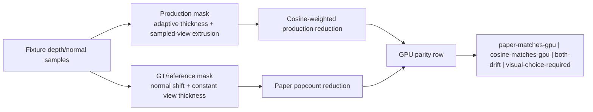

# Design: VBAO GT/Reference vs Production Alignment

## Semantics

- **Production VBAO** means the current `VBAONode` shader and matching scalar oracle in `vbaoReference.ts`.
- **GT/reference VBAO** means the paper/community-GLSL-aligned scalar path in `vbaoPaperReference.ts`.
- `paperExpected` MUST be computed from paper-aligned masks, not from production masks with a different reducer.
- The parity page remains internal and may expose diagnostic mask arrays for review.

## Non-goals

- No public API expansion.
- No production build.
- No automatic switch from cosine-weighted production to popcount paper reduction.
