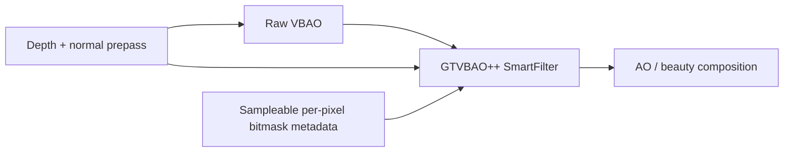

# Design: GTVBAO++ SmartFilter Pass

## Pass placement

The pass lives after raw VBAO and before composition. It does not consume the generic filtered output and does not wrap `metadata-aware` v1.

## Signals

- raw VBAO accessibility;
- view-space depth/normal;
- edge-depth / edge-normal / confidence;
- `maskCoverage`;
- production `maskPopcount`;
- paper/reference `paperPopcount`;
- sampleable center/tap metadata deltas from the internal bitmask metadata texture.

## SmartFilter rule

A tap is allowed only when geometry, AO value, and bitmask confidence agree. This is intentionally stricter than a bilateral blur: the bitmask signals gate whether a local AO value is blendable before weight calculation.

## Current limitation

The candidate now uses an internal sampleable metadata texture for center/tap bitmask comparison. It is still demo-only: the metadata is diagnostic and filter-facing, not a promoted public `VBAONodeOptions` or `@horizonao/core` output.
