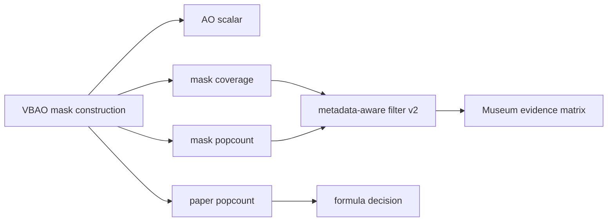

# Design: VBAO Mask Coverage / Popcount Metadata

## Visual Review Decision

The metadata-aware filter gate failed promotion. The reviewed screenshots still
show:

- `noise`;
- `false-curvature`;
- `scale-mismatch`;
- generic filtering additionally trends toward `mud`.

So the next implementation should expose bitmask-derived metadata rather than
tuning edge/depth blur weights blindly.

## Required Internal Signals

For each shaded pixel, the GPU-side VBAO path needs internal metadata equivalent
to:

- `maskCoverage`: average blocked-sector coverage across slices;
- `maskPopcount`: normalized average `countOneBits(occludedMask) / 32`;
- `paperPopcount`: internal SSILVB-style popcount accessibility using normal
  shift and constant view-direction thickness for formula comparison;
- optional later: per-slice variance / saturation indicators.

These are not public API. They are diagnostic/filter guide channels.

## Phase 2 Implementation Note

The first implementation exposes `mask-coverage` and `mask-popcount` as
demo-only debug views in `MuseumScene.tsx`. The values are computed by a
GPU-side visibility-mask construction path that builds `occludedMask` with
`bitOr(maskRange)` and reads it with `countOneBits(occludedMask)`. They are not
computed from the final AO scalar.

The follow-up debug pass adds `paper-popcount`, also demo-only. It constructs an
independent `vbaoPaperReferenceOccludedMask` with the SSILVB-style projected
normal shift, front/back sector range, constant view-direction thickness, and
popcount reduction. This is a formula/debug comparison channel, not a promoted
production formula.

This remains internal evidence plumbing. Filter v2 still needs to consume these
signals before any promotion claim.

## Candidate Architecture

## Acceptance Rule

The next filter revision can only be promoted if evidence shows it reduces
`noise` without worsening `mud`, `edge-bleed`, `halo`, `thin-gap`,
`false-curvature`, or `scale-mismatch`.

## Current Rating

| Dimension | Rating | Notes |
| --- | ---: | --- |
| Oracle readiness | 8/10 | Hardened fixture parity is green enough to guard new work. |
| Metadata-aware v1 quality | 5/10 | Correctly wired, but rejected by visual evidence. |
| Mask metadata readiness | 6/10 | Debug-visible mask and paper-popcount channels exist; filter v2 does not consume them yet. |
| API discipline | 9/10 | Public surface remains clean. |
| Promotion readiness | 3/10 | Evidence rejects promotion until mask metadata exists. |

## Revised Roadmap

See `roadmap.md` in this change for the executable SDD sequence, diagrams, and
stop conditions.
