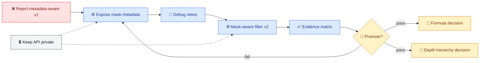
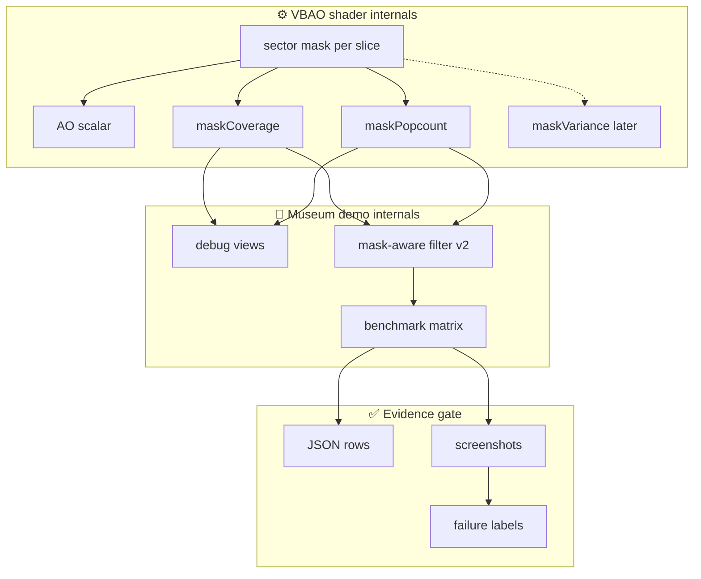

# VBAO Mask Metadata Roadmap

_Roundtable revision for the next gate after rejecting metadata-aware v1._

---

## Current Shape

| Area | Current state | Candid rating | Why |
| --- | --- | ---: | --- |
| Hardened parity oracle | Green for current fixture matrix, including true-normal corner rows | 8/10 | Good internal correctness tripwire; still not exhaustive ground truth. |
| Paper/formula reconciliation | Instrumented, not decided | 6/10 | Paper-style and cosine paths are comparable, but visual formula choice is not closed. |
| Depth hierarchy | Diagnostic/prototype only | 4/10 | Existing prefilter is not promoted and can create false curvature. |
| Metadata-aware v1 filter | Implemented, rejected for promotion | 5/10 | Spatial-only and correctly gated, but still shows noise, false curvature, and scale mismatch. |
| GPU-visible bitmask metadata | Debug views implemented; filter consumption pending | 5/10 | Mask coverage/popcount are visible in the Museum evidence harness, but filter v2 does not consume them yet. |
| Evidence discipline | Stronger than before | 7/10 | JSON/screenshots/timings exist; failure labels now reject promotion instead of hand-waving. |
| Public API discipline | Healthy | 9/10 | No `VBAONodeOptions` expansion and no public mask/filter export. |

## Revised Gate Sequence

## Architecture Slice

## Semantic Contract

| Term | Meaning | Promotion use |
| --- | --- | --- |
| `maskCoverage` | Average blocked-sector fraction across slices | Reject saturated broad masks that likely cause false curvature. |
| `maskPopcount` | Normalized average popcount, equivalent to `countOneBits(mask) / 32` per slice | Detect sparse vs. saturated occlusion before blending. |
| `maskVariance` | Later optional spread across slices | Detect unstable/directional disagreement. |
| `edgeDepth` | Geometric depth discontinuity | Preserve silhouette and depth edges. |
| `edgeNormal` | Geometric normal discontinuity | Preserve corners and surface changes. |
| `confidence` | Local geometry confidence | Avoid blending low-quality neighborhoods. |

## Next Tasks

1. **RED contract first**
   - Add source tests requiring internal `mask-coverage` / `mask-popcount`
     debug views.
   - Assert no `VBAONodeOptions` or `@horizonao/core` export changes.
   - Assert the metadata-aware v1 evidence remains rejected.

2. **Real GPU metadata channel**
   - Produce mask coverage/popcount beside a GPU visibility-mask construction.
   - Do not derive it from final AO after the fact.
   - Keep the channel internal to demo/evidence plumbing until promotion.
   - Status: initial Museum debug views implemented.

3. **Debug and benchmark**
   - Add Museum debug views for `mask-coverage` and `mask-popcount`.
   - Add benchmark matrix rows for the mask metadata views.
   - Capture 1920×1080 primary and 1280×720 secondary screenshots.
   - Status: initial 10-row WebGPU debug matrix captured.

4. **Filter v2**
   - Add a mask-aware spatial candidate.
   - Reject taps with saturated or inconsistent masks before blending.
   - Keep it temporal-free.

5. **Decision**
   - Compare raw VBAO, metadata-aware v1, mask-aware v2, GTAO, and N8AO.
   - Promote nothing unless it reduces `noise` without worsening `mud`,
     `edge-bleed`, `halo`, `thin-gap`, `false-curvature`, or
     `scale-mismatch`.

## Stop Conditions

- If mask metadata is not independently visible in debug screenshots, stop.
- If the filter still preserves hatch noise, stop.
- If it removes noise by adding mud, stop.
- If public API needs expansion before evidence passes, stop.
- If depth-prefilter changes are needed, split into a separate gate.
