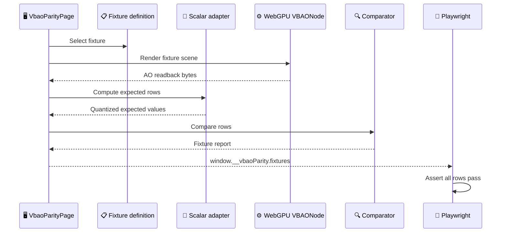
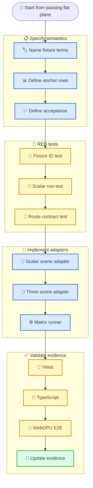

# Design: VBAO Parity Fixture Expansion

## Architecture

The fixture expansion turns `/vbao-parity` into a deterministic matrix runner:
each fixture has a scalar adapter and a Three/WebGPU scene adapter, both driven
by the same semantic fixture definition.

```mermaid
flowchart LR
    accTitle: VBAO Fixture Architecture
    accDescr: Fixture definitions feed both scalar and WebGPU adapters, then readback rows are compared and reported to Playwright

    fixture_def[📋 Fixture **definition**]
    scalar_adapter[🧮 Scalar **adapter**]
    scene_adapter[🎨 Three scene **adapter**]
    vbao_node[⚙️ VBAO **node**]
    readback[📥 GPU **readback**]
    comparator[🔍 Quantized **comparator**]
    report[📊 Parity **report**]
    e2e[🧪 Playwright **gate**]

    fixture_def --> scalar_adapter
    fixture_def --> scene_adapter
    scene_adapter --> vbao_node
    vbao_node --> readback
    scalar_adapter --> comparator
    readback --> comparator
    comparator --> report
    report --> e2e

    classDef source fill:#ede9fe,stroke:#7c3aed,stroke-width:2px,color:#3b0764
    classDef process fill:#dbeafe,stroke:#2563eb,stroke-width:2px,color:#1e3a5f
    classDef evidence fill:#dcfce7,stroke:#16a34a,stroke-width:2px,color:#14532d

    class fixture_def source
    class scalar_adapter,scene_adapter,vbao_node,readback,comparator process
    class report,e2e evidence
```

## Runtime Sequence

## Semantic Elements

| Term | Meaning | Interface pressure |
| --- | --- | --- |
| `FixtureScene` | A tiny deterministic AO scene with explicit geometry, camera, anchor pixels, and acceptance rows. | Must be small enough for scalar mirroring. |
| `Surface` | Analytic primitive that can return view-space position, normal, and validity for a screen UV. | Must match the Three mesh adapter exactly enough for fixed pixels. |
| `AnchorPixel` | Named readback pixel used for scalar/GPU comparison. | Must land on the intended receiver surface, not on a silhouette. |
| `SceneAdapter` | Three/WebGPU geometry builder for one fixture. | Adapter, not public API; allowed to be demo/test-only. |
| `ScalarAdapter` | CPU mirror of the same fixture. | Must mirror Three Y flip, shader noise quantization, and sampling path. |
| `ReadbackNormalizer` | Converts WebGPU row-padded bytes into one AO value per pixel. | Must handle R8 and RGBA-style buffers without guessing rows wrong. |
| `ParityRow` | `fixtureId + anchorPixel + gpu + expectedQuantized + absError + passed`. | This is the evidence atom. |

## Fixture Semantics

| Fixture | Purpose | Receiver | Blocker / discontinuity | Primary failure label protected |
| --- | --- | --- | --- | --- |
| `flat-plane` | Sanity and readback contract. | Single XY plane. | None. | shader/reference drift |
| `two-wall-corner` | Contact/corner visibility. | Floor near a wall corner. | Two perpendicular walls. | `edge-bleed`, `scale-mismatch` |
| `thin-occluder` | Thin-geometry handling. | Floor behind/near a narrow blocker. | Slender vertical occluder. | `thin-gap`, `false-curvature` |

## Task Dependency Graph

## Architecture Decision

Use **fixture-specific analytic adapters**, not a generic geometry interpreter.

| Option | Tradeoff |
| --- | --- |
| Fixture-specific adapters | Fast to validate, small interface, low ambiguity. Requires adding each fixture intentionally. |
| Generic scene parser | More reusable later, but too much surface area now; easy to hide parity bugs behind parser bugs. |

Decision: use fixture-specific adapters until at least three fixtures pass. Then
reconsider whether a generic scene adapter earns its interface.

## Implementation Note: First Matrix vs Hardening Matrix

The first passing matrix intentionally uses **frontal-rect analytic fixtures**:
flat plane, L-shaped depth-band corner proxy, and a frontal thin occluder over a
receiver plane. This is the right first gate for GPU/scalar plumbing because the
depth, normal, row-padding, quantized-noise, and adaptive-thickness details are
deterministic enough to debug.

This is **not** the final semantic coverage for production VBAO. The next
hardening matrix must add:

- a true perpendicular-wall corner with non-`+Z` view-space normals;
- a thin-occluder silhouette guard that rejects coverage-ambiguous anchor
  pixels before accepting evidence.

The fixture name `two-wall-corner` is therefore accepted for the matrix route,
but the current evidence is scoped to an L-depth proxy until the hardening tasks
pass.

## Hardening Update

The matrix now includes `two-wall-corner-true-normal` in addition to the original
`two-wall-corner` proxy. The hardening fixture keeps the old route internal but
adds wall planes whose scalar and WebGPU normals are not `+Z`, plus anchor
validation metadata that can reject silhouette-adjacent thin-occluder anchors.

During the first hardened WebGPU run, two wall anchors produced `both-drift`
rows even though they were not immediate silhouettes. The route now exposes
internal normal and fixture readback diagnostics so the drift can be separated
from G-buffer normal errors. The diagnostic proved the wall MRT normals matched
the scalar fixture (`+X` and `-Y`), so the accepted anchors were moved to stable
interior wall pixels that pass the same tolerance.

The parity report also carries a formula label per row:

- `paper-matches-gpu`
- `cosine-matches-gpu`
- `both-drift`
- `visual-choice-required`

This keeps paper/popcount-vs-current-cosine disagreement visible in the oracle
instead of hiding it behind a single `passed` boolean.
