# VBAO Next Steps and Literature Contrast

## 🎯 Executive stance

Current VBAO work is now strong enough to be called an **internal correctness
harness**, not strong enough to be called production visual quality. The next
work should not chase screenshots first. It should harden the fixture oracle,
then implement the temporal-free filter against named failure labels.

The literature does not support a “just blur it” path. SSILVB/VBAO is about
visibility-bitmask semantics for thin-surface visibility.[^1] XeGTAO and CACAO
both show production discipline around depth preparation, edge information, and
spatial denoise passes.[^2][^3] NRD shows what a high-end guided denoiser expects
from a renderer: per-pixel guides and explicit signal packing, but it is mostly
spatio-temporal and therefore not the first acceptance path for this project.[^4]
Filter-adapted sampling says the sampling pattern and the intended filter are
coupled; that matters directly for our “temporal-free first” target.[^5]

## 🧭 Roadmap layout

```mermaid
flowchart LR
    accTitle: VBAO Next Gate Roadmap
    accDescr: Roadmap from current parity matrix through literature-grounded hardening and temporal-free filtering.

    current["✅ Current<br/>3-fixture GPU/scalar matrix"]
    harden["🧪 Harden fixtures<br/>true normals + silhouettes"]
    paper["📐 Paper parity<br/>SSILVB bitmask formula"]
    depth["🧱 Depth hierarchy<br/>footprint MIP + edge veto"]
    filter["🧹 Temporal-free filter<br/>depth normal mask confidence"]
    evidence["📊 Evidence gate<br/>raw filtered GTAO N8AO"]
    decide["🚦 Decision<br/>promote or reject"]

    current --> harden
    harden --> paper
    paper --> depth
    depth --> filter
    filter --> evidence
    evidence --> decide

    classDef done fill:#dcfce7,stroke:#16a34a,stroke-width:2px,color:#14532d
    classDef next fill:#dbeafe,stroke:#2563eb,stroke-width:2px,color:#1e3a5f
    classDef gate fill:#fef9c3,stroke:#ca8a04,stroke-width:2px,color:#713f12
    classDef decision fill:#fee2e2,stroke:#dc2626,stroke-width:2px,color:#7f1d1d

    class current done
    class harden,paper,depth,filter next
    class evidence gate
    class decide decision
```

## 📚 Literature contrast matrix

| Source | What the source implies | Current horizon-ao status | Required next action |
| --- | --- | --- | --- |
| SSILVB / VBAO paper | Visibility is represented as sector state, not one horizon interval; thin surfaces must allow light behind them.[^1] | Bitmask machinery exists, but fixtures do not yet prove true corner normals and thin-silhouette behavior. | Add hardening fixtures with true perpendicular-wall normals and silhouette-safe thin anchors. |
| Community GLSL implementation | Practical GLSL path confirms the idea can run as a fixed-cost screen-space method, but it is not a production validation oracle.[^6] | Useful source for implementation intuition only. | Keep it as a comparison reference, not as truth. Paper + GPU readback remain the oracle. |
| XeGTAO | Production AO is not just a kernel; it has depth prefiltering, main pass, edge info, spatial denoise, and ray-traced reference tuning.[^2] | We now have GPU/scalar fixture parity, but not ray-traced or exhaustive visual tuning. | Add raw-vs-filter-vs-baselines evidence and keep failures named: `noise`, `mud`, `edge-bleed`, `false-curvature`. |
| CACAO | Depth MIPs, de-interleaved buffers, edge values, importance maps, and bilateral/edge-aware filtering are first-class pipeline pieces.[^3] | Existing depth prefilter is a candidate helper, not a CACAO-style hierarchy. | Implement footprint-selected depth MIP behavior or keep prefilter out of promotion. |
| NRD | High-end denoise uses G-buffer guides and explicit noisy signal packing, but relies on spatio-temporal reconstruction.[^4] | We intentionally do not use temporal history as the first fix. | Borrow guide discipline: depth, normal, viewZ, confidence, mask coverage; reject NRD-style temporal dependency for first acceptance. |
| Filter-adapted sampling | Sampling should be designed for the filter that will consume the result, not chosen independently.[^5] | We have sample schedules and metadata views, but the filter is not yet co-designed with the schedule. | Evaluate raw VBAO + candidate filter as a pair; do not accept a sampling pattern that only looks good before filtering. |

## 🧱 Next task breakdown

### 1. Harden the fixture oracle

- Add `two-wall-corner-true-normal`: floor plus two perpendicular walls with
  non-`+Z` normals.
- Add a thin-occluder anchor validator:
  - reject anchor if it lands on a silhouette or within 1 pixel of a depth
    discontinuity;
  - record the rejected anchor in evidence when debugging.
- Acceptance:
  - Vitest scalar rows finite;
  - WebGPU matrix rows pass;
  - no public API changes.

### 2. Reconcile paper formula vs production formula

- Keep both scalar paths:
  - paper/popcount/normal-shift variant;
  - current cosine-weighted production variant.
- Add fixed fixtures that compare both variants and label which one better
  matches GPU output and visual intent.
- Acceptance:
  - every formula mismatch is named, not hand-waved;
  - no shader promotion until GPU readback agrees with the selected formula.

### 3. Replace prototype depth prefilter

- Implement footprint-selected depth MIP candidate selection.
- Use edge depth, edge normal, confidence, and depth delta vetoes.
- Acceptance:
  - thin foreground objects do not become broad bands;
  - `false-curvature` is reduced or unchanged, never worse.

### 4. Implement temporal-free metadata-aware filter

- Inputs:
  - raw AO;
  - depth;
  - normal;
  - mask coverage/popcount confidence;
  - edge-depth and edge-normal metadata.
- Filter:
  - edge-aware spatial weights;
  - mask-confidence gating;
  - no history, no TAA requirement.
- Acceptance:
  - lower `noise` without introducing `mud`, `edge-bleed`, or
    `false-curvature`.

### 5. Production evidence gate

- Compare:
  - raw VBAO;
  - filtered VBAO;
  - GTAO;
  - N8AO;
  - candidate variants.
- Resolutions:
  - 1920×1080 primary;
  - 1280×720 secondary.
- Required artifacts:
  - screenshots;
  - GPU timings;
  - JSON matrix;
  - named failure labels.

## 🚦 Promotion criteria

| Criterion | Promote only if |
| --- | --- |
| Correctness | Hardened GPU/scalar fixtures pass, including true normal corner and thin-silhouette-safe occluder rows. |
| Literature alignment | Paper-bitmask behavior is either implemented or explicitly rejected with fixture evidence. |
| Temporal-free quality | Spatial filter improves `noise` without worse `mud`, `edge-bleed`, `scale-mismatch`, or `false-curvature`. |
| Production discipline | Depth hierarchy and edge metadata behave like first-class pipeline stages, not debug-only experiments. |
| Evidence | Screenshots + timings + JSON are committed and named. |

## 🔖 References

[^1]: Olivier Therrien, Yannick Levesque, Guillaume Gilet. “Screen Space Indirect Lighting with Visibility Bitmask.” arXiv:2301.11376. https://arxiv.org/abs/2301.11376
[^2]: Intel GameTechDev. “XeGTAO.” https://github.com/GameTechDev/XeGTAO
[^3]: AMD GPUOpen. “FidelityFX Combined Adaptive Compute Ambient Occlusion (CACAO) 1.4.” https://gpuopen.com/manuals/fidelityfx_sdk/techniques/combined-adaptive-compute-ambient-occlusion/
[^4]: NVIDIA RTX. “NVIDIA Real-Time Denoisers (NRD).” https://github.com/NVIDIA-RTX/NRD
[^5]: William Donnelly, Alan Wolfe, Judith Bütepage, Jon Valdés. “Filter-adapted spatiotemporal sampling for real-time rendering.” arXiv:2310.15364. https://arxiv.org/abs/2310.15364
[^6]: Cybereality. “Screen Space Indirect Lighting with Visibility Bitmask: Improvement to GTAO/SSAO Real-Time Ambient Occlusion Algorithm (GLSL Shader Implementation).” https://cybereality.com/screen-space-indirect-lighting-with-visibility-bitmask-improvement-to-gtao-ssao-real-time-ambient-occlusion-algorithm-glsl-shader-implementation/
