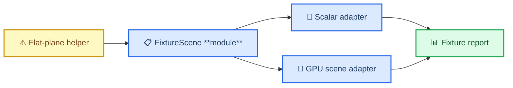
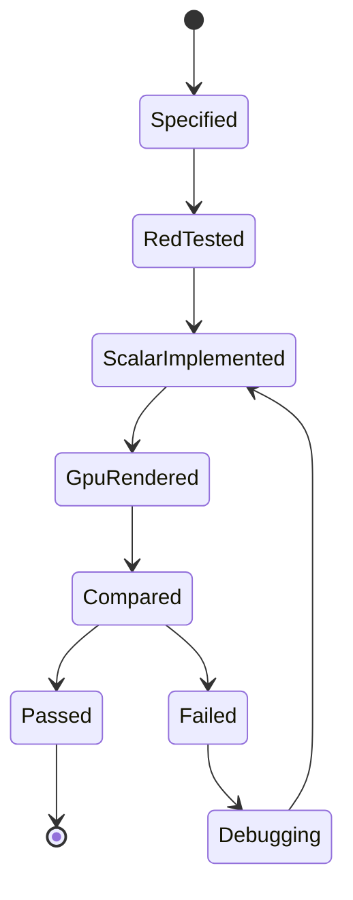

# Ultra-Plan: VBAO Parity Fixture Expansion

## Scope

This change expands parity from one flat-plane fixture to a small semantic
fixture matrix. The goal is not prettier screenshots; the goal is a deeper
correctness contract where scalar reference and GPU shader must agree on geometry
that matters.

## Module Deepening

The parity implementation is split into direct `vbaoParity/` modules. Callers
import the module they need directly. The modules own geometry semantics,
sampling, quantization, diagnostics, and row comparison.

## Acceptance Ladder

## Work Order

1. Lock semantic names and row schema.
2. Add RED tests for matrix shape.
3. Extract flat-plane into the new fixture seam without changing behavior.
4. Add two-wall corner scalar adapter.
5. Add two-wall corner GPU adapter.
6. Add thin-occluder scalar adapter.
7. Add thin-occluder GPU adapter.
8. Run route-level WebGPU parity.
9. Update evidence and stop if any fixture fails.

## Non-Negotiables

- No production build.
- No public API expansion.
- No spatial-filter work until fixture parity is green.
- No broad tolerance to hide mismatch.
- No screenshot promotion from fixture parity alone.
