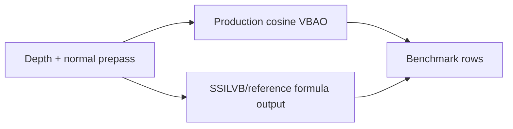

# Design: SSILVB/reference Formula Ablation

## Pass placement

## Contract

The ablation is selected through an internal Museum benchmark state:

- `production-cosine` renders existing raw `VBAONode` output.
- `ssilvb-reference` renders the internal SSILVB/reference accessibility scalar.

The variant is demo-only. It does not change package exports and does not add a runtime public option.

## Acceptance

The ablation only informs a later decision. It does not promote SSILVB/reference output by itself.

Promotion requires two gates:

1. Visual evidence rows for both 1920x1080 and 1280x720, in Beauty and AO,
   without blocking labels: `mud`, `halo`, `thin-gap`, `edge-bleed`,
   `false-curvature`, or `scale-mismatch`.
2. Explicit hardened GPU parity for the promoted SSILVB/reference variant.

If either gate fails, production remains `production-cosine`.
