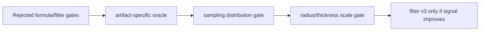

# Design: Upstream Signal Correction

## Principle

Fix the raw signal before trying to hide it. The next gates are artifact-specific oracle coverage, then a sampling distribution gate, then a radius/thickness scale gate.



## Artifact-specific oracle

Fixtures target the failure labels that blocked promotion:

- `thin-gap-parallel-planes` targets `thin-gap` and `edge-bleed`.
- `large-flat-floor-no-curvature` targets `false-curvature` and `scale-mismatch`.
- `small-contact-object-on-plane` targets `scale-mismatch` and `mud`.
- `grazing-wall-corner` targets `mud` and `false-curvature`.
- `subpixel-thin-occluder` targets `noise`.

## Sampling distribution gate

Compare sampling changes against the artifact fixtures before Museum screenshots. A candidate must reduce structured `noise` without increasing the other named failure labels.

## Radius/thickness scale gate

Compare radius/thickness changes against small-contact, large-flat-floor, thin-gap, and corner fixtures. A candidate must reduce `scale-mismatch` and `false-curvature` without closing thin gaps.

## Adaptive radius/thickness candidate

Gate 2 chooses one candidate only: `fixture-adaptive-v1`.

The candidate is internal fixture-gate logic, not a production shader switch. It
derives radius/thickness from the artifact class:

- thin gaps shrink radius and thickness to avoid closing the gap;
- large flat floors cap radius/thickness to avoid `false-curvature`;
- small contacts keep the footprint tight to avoid broad `mud`;
- grazing corners lower thickness so wall reach does not become false curvature;
- subpixel occluders stay narrow until sampling proves stability.

Promotion is still blocked. `fixture-adaptive-v1` may only advance to GPU fixture
comparison when the internal label model improves at least one targeted label
and introduces no new label relative to `museum-baseline`.

## GPU fixture comparison gate

Gate 3 wires `fixture-adaptive-v1` into `/vbao-parity` as a second internal
readback path:

- baseline readbacks use current raw VBAO parity config;
- candidate readbacks use `fixture-adaptive-v1` radius/thickness for the
  upstream artifact fixtures;
- non-upstream parity fixtures reuse baseline config so the historical parity
  tripwires stay stable;
- candidate readbacks must match scalar rows with the same quantized tolerance
  as the baseline matrix.

The result may only become `ready-for-museum-matrix` when:

1. raw baseline GPU/scalar parity passes;
2. adaptive candidate GPU/scalar parity passes;
3. the label model improves at least one targeted label;
4. no label worsens.

Even then, production remains `museum-baseline`; the next step is Museum
evidence, not API promotion.

## Museum matrix gate

Gate 4 uses `AO_BENCHMARK_VBAO_ADAPTIVE_RADIUS_MATRIX=1` to keep the capture
narrow:

- single-mode rows only, no compose matrix;
- raw rows only, no spatial-filter matrix;
- `beauty` and `ao` views;
- `1920x1080` and `1280x720`;
- GTAO, baseline VBAO, `fixture-adaptive-v1` VBAO, and N8AO.

The Museum projection of `fixture-adaptive-v1` is benchmark-only and uses the
conservative fixture-derived radius/thickness pair (`radius=0.22`,
`thickness=0.06`). It is intentionally not a public option and not a claim that
the live production shader is dynamically fixture-aware.

## Support-bitmask visibility candidate

The next math candidate is `support-bitmask-v1`: a confidence-aware visibility
bitmask that stays native to WebGPU integer operations.

Production VBAO currently treats any sample interval as equally decisive:

```text
M = OR_j mask(theta_front_j, theta_back_j)
A_i = sum_k open(M_k) * max(0, cos(theta_k - gamma_i))
      --------------------------------------------------
      sum_k             max(0, cos(theta_k - gamma_i))
```

That binary OR is fast, but it lets one noisy/depth-discontinuous tap own the
same sector as a coherent wall. The revised candidate keeps two `u32` bit
planes per slice:

```text
H_1 = sectors hit by at least one interval
H_2 = sectors with repeated support OR broad single-interval support
```

The first draft only marked `H_2` when two sample intervals overlapped. That
was too aggressive: a near/thick blocker may legitimately cover many sectors in
one interval. Treating that as the same weak evidence as a one-sector speckle
would under-occlude real contact. The revision adds broad self-support using
native bit population count:

```text
b_j <- m_j if countOneBits(m_j) >= 8 else 0
H_2 <- H_2 OR (H_1 AND m_j) OR b_j
H_1 <- H_1 OR m_j
```

Reduction then uses support confidence instead of binary openness:

```text
visibility_k = 0       if H_2[k] = 1
             = 1 - λ   if H_1[k] = 1 and H_2[k] = 0
             = 1       otherwise

A_i = sum_k visibility_k * max(0, cos(theta_k - gamma_i))
      ----------------------------------------------------
      sum_k                max(0, cos(theta_k - gamma_i))
```

Initial scalar contracts use `λ = 0.45` and a broad interval threshold of `8`
sectors. Both numbers are intentionally internal and non-promotional. They can
move only after the expanded GPU fixture matrix shows reduced `noise` or
`false-curvature` without worsening `thin-gap`, `edge-bleed`, `mud`, or
`scale-mismatch`.

Tradeoffs:

- Pros: WGPU-friendly, no storage buffers, no atomics, no public API; coherent
  blockers converge to the current binary result.
- Pros: broad single intervals preserve near/thick blockers instead of treating
  them as speckle.
- Risk: true narrow subpixel occluders may still be underweighted, so the
  `subpixel-thin-occluder` and `thin-gap-parallel-planes` fixtures are hard
  blockers for promotion.
- Scope: math/spec/scalar contracts first; live `VBAONode` shader wiring comes
  only after RED GPU fixture tests exist.

## WGPU precision/memory envelope

Every future raw-signal candidate must carry an explicit WebGPU precision and
memory contract before shader promotion. The point is simple: scalar math can
be correct and the GPU artifact can still differ because the live path combines
floating-point evaluation, texture formats, readback padding, normal packing,
and discontinuous sectorization.

Current repo constraints:

- Raw `VBAONode` AO is read as an 8-bit red-channel target in the parity route,
  so expected values must be compared after byte quantization.
- WebGPU texture-to-buffer readback rows are 256-byte aligned in the route
  normalizer; tests must not treat mapped readback memory as tightly packed
  unless the byte length proves it.
- Museum normal evidence is packed through `UnsignedByteType`; any candidate
  that depends on normal precision must document that format.
- Horizon sector indices come from `atan -> floor/ceil`; anchors on sector
  boundaries are not stable acceptance points.
- `u32` bit operations and `countOneBits` are exact only after the float-derived
  sample interval has already been converted to a mask.

Candidate gate:

```text
scalar contracts
AND GPU fixture contracts
AND quantized AO readback tolerance
AND row-padding handling
AND sector-boundary-safe anchors
AND normal/depth format notes
=> ready for precision-aware GPU fixture gate
```

Passing this gate still does not promote production. It only means the candidate
is safe enough to compare on `/vbao-parity` without lying to ourselves about
WebGPU memory or float behavior.

## Support-bitmask live parity route

`support-bitmask-v1` now has an evidence-only live route path:

- `VBAONode` defaults to binary visibility.
- `/vbao-parity` may call the internal benchmark visibility hook for
  `support-bitmask-v1`.
- The scalar mirror computes support-bitmask rows with the same byte-quantized
  tolerance as the baseline parity matrix.
- The route can report either `ready-for-label-review` or
  `reject-support-bitmask-gpu-fixture`; neither verdict promotes production.

The first local WebGPU route run rejected label review on
`subpixel-thin-occluder`. Follow-up fixture stabilization found that the upper
and lower receiver anchors were accidentally sampling the same pixel; the lower
anchor is now distinct and baseline-stable. The remaining candidate mismatch is
localized to `subpixel-thin-left-upper-receiver`, drifting by about six AO
bytes. That is exactly why the precision envelope exists: the candidate is
interesting, but it is not evidence-clean yet.

## Filter v3 is blocked

Filter v3 is blocked until either the sampling distribution gate or the radius/thickness scale gate improves the raw signal. No new filter tuning should happen while raw signal failures remain unchanged.
