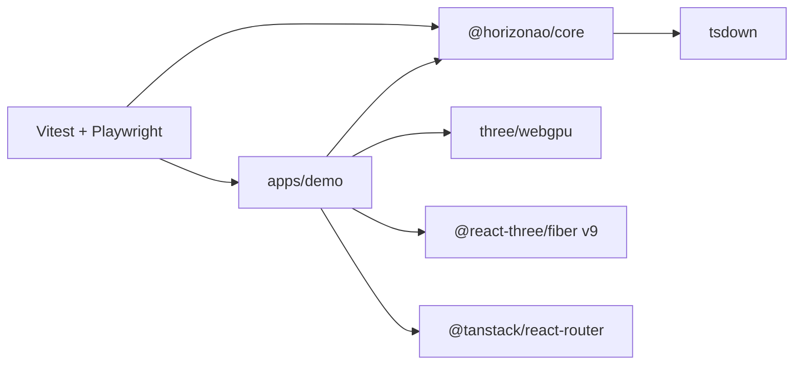

# Design: Bootstrap HorizonAO

## Architecture

## Decisions

| Decision | Why | Tradeoff |
| --- | --- | --- |
| WebGPU-first via `WebGPURenderer` | Matches Three's current direction and R3F v9 async renderer support. | Some older Three/Drei shader utilities are not ready. |
| Keep TS6 plus TS7 native-preview | TS7 is beta/native-preview, not stable `typescript@7`. | Two typecheck scripts instead of one. |
| Code-based TanStack routes for bootstrap | Avoid generated route tree churn while the scene set is tiny. | File-based routing can replace this once routes grow. |
| Remote asset manifest | Keeps git light and licenses visible. | Offline demo needs a later mirroring task. |
| Custom environment component | Drei Environment uses cube render target internals; we need predictable WebGPU behavior first. | Less physically rich than HDRI environment presets. |

## WebGPU Canvas

R3F v9 allows `Canvas.gl` to return a Promise. The demo creates `new WebGPURenderer(props)`, awaits `renderer.init()`, then returns the renderer to R3F.

## Scene Strategy

- Sponza uses Khronos glTF as a large interior lighting stress scene.
- Suzanne uses Khronos glTF for a classic Blender primitive.
- Bunny uses a browser-friendly CC0 GLB mirror while documenting the Stanford source.
- Grid uses `InstancedMesh` over XZ for the stress-test baseline.

## Testing

Vitest covers public library behavior. Playwright starts Vite dev server, navigates routes, waits for the canvas, and samples pixels. It does not run a production build.
