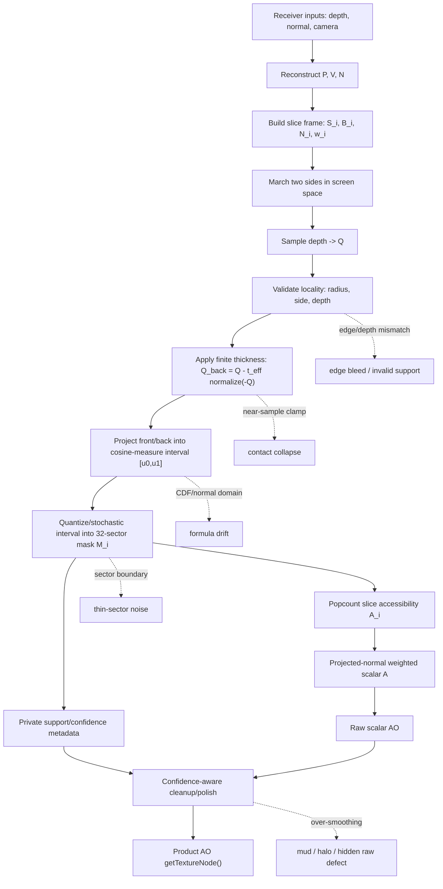
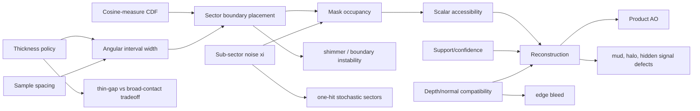

# Design: VBAO Angular Interval Solver Board

## Principal Decision

Treat `VBAONode` as one angular interval solver:

```text
receiver input -> interval construction -> sector occupancy -> scalar/accessory
state -> reconstruction -> public AO
```

The shader can still be implemented as fullscreen passes. The mental model is
the solver, not the pass list.

## Solver Equation

For a receiver pixel, reconstruct:

```text
P = view-space receiver position
N = receiver normal
V = normalize(-P)
```

For each slice `i`:

```text
S_i = axial slice direction over pi with two-sided marching
B_i = normalize(cross(S_i, V))
N_i = normalize(N - B_i * dot(N, B_i))
w_i = length(N - B_i * dot(N, B_i))
```

For each side and sample:

```text
Q = reconstructed view-space sample position
D_front = normalize(Q - P)
t_eff = min(t_base, sampleDistance * nearSampleRatio)
Q_back = Q - t_eff * normalize(-Q)
D_back = normalize(Q_back - P)
u0, u1 = cosineMeasureCDF(D_front, D_back, V, S_i, N_i)
M_i |= intervalMask(u0, u1, xi)
```

Reduce:

```text
A_i = 1 - popcount(M_i) / 32
A = sum_i(A_i * w_i) / max(sum_i(w_i), epsilon)
AO = 1 - (1 - pow(A, contrast)) * strength
```

This is the center of the board. Every quirk below changes one of these terms.

## Source Ownership

| Solver term | Runtime owner | Reference owner | Main risk |
| --- | --- | --- | --- |
| `P`, `Q`, `V` reconstruction | `packages/horizon-ao/src/VBAONode.ts` | `packages/horizon-ao/reference/vbaoReference.ts` | wrong space or half-res coordinate mismatch |
| `t_base` / `t_eff` | `vbaoConstants.ts`, `VBAONode.ts` | `vbaoReference.ts` | contact collapse or thin-gap closure |
| `Q_back` sample-local thickness | `VBAONode.ts` | `vbaoGtVbaoMath.ts` | using receiver view vector instead of sample-local vector |
| `u0`, `u1` CDF interval | `VBAONode.ts` | `vbaoGtVbaoMath.ts` | double cosine weighting or wrong signed slice domain |
| `intervalMask` | `VBAONode.ts` | `vbaoGtVbaoMath.ts` | boundary instability and stochastic variance |
| `M_i` support/confidence | private runtime sidecar | `vbaoReceiverConfidence.ts` | smoothing unsupported sectors as if trustworthy |
| reconstruction | cleanup/resolve/polish nodes | product evidence gates | hiding raw defects or bleeding across edges |

## Integrated Diagram



## Quirk Dependency Graph



## Contrast With Other Models

| Model | Representation | Strength | Failure mode |
| --- | --- | --- | --- |
| SSAO | independent depth comparisons | simple and cheap | noisy, bias/falloff driven |
| HBAO/GTAO | horizon angles | coherent scalar integration | collapses multiple gaps/blockers too early |
| Simple VBAO | sector mask from finite intervals | preserves discontinuous visibility | rough thickness, uniform mapping, blur dependence |
| Current `VBAONode` | sample-local finite intervals, CDF sectors, stochastic thin sectors, projected slice weights | stronger thin-visibility contract | more coupled terms; harder evidence discipline |
| WI/SPWI transport | distance-domain intervals across probes/cascades | useful for GI/radiance transport | wrong abstraction for local AO if copied literally |

## DRY/KISS/YAGNI Consolidation Rules

- DRY: consolidate duplicated validity, thickness, and confidence semantics only
  after the reference and runtime paths agree on names.
- KISS: keep the raw hot loop in one readable owner until extracting helpers
  makes generated shader inspection simpler.
- YAGNI: do not expose public knobs for terms that evidence can choose
  internally.
- Delete candidates that do not improve a named equation term, failure label, or
  timing row.
