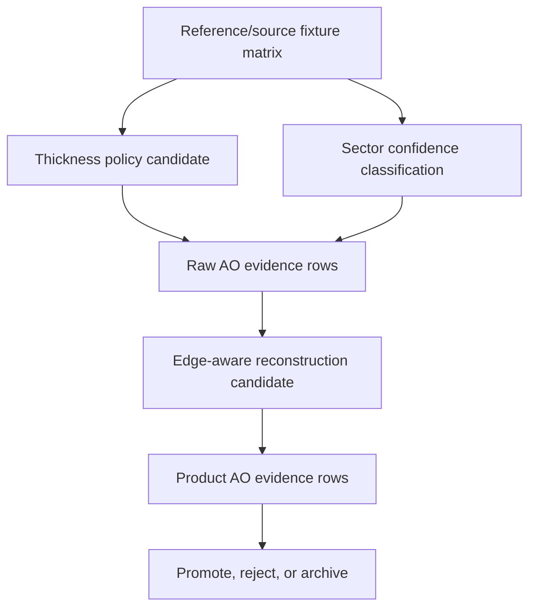

# Raw Signal Tightening: First Implementation Slice

This is the first executable slice from the angular interval solver board.

The phrase "tighten raw VBAO signal" covers three related tracks, but they do
not sit at the same layer:

```text
raw estimator:
  thickness policy
  sector confidence/support

raw-preserving product reconstruction:
  edge-aware reconstruction
```

That distinction matters. If reconstruction improves the final screenshot while
the raw estimator is still wrong, the solver has not improved. It has only been
masked.

## Track 1: Thickness Policy

### Solver Term

```text
t_base = min(thickness, radius * contactThicknessRatio)
t_eff  = min(t_base, sampleDistance * nearSampleThicknessRatio)
Q_back = Q - t_eff * normalize(-Q)
```

### Quirk

The current policy protects near samples from producing impossible slabby
intervals, but it also creates the strongest raw-signal suspicion:

- near-contact samples can collapse to intervals that are too thin;
- broad contact can be under-occluded by the radius cap;
- raising thickness globally can close valid thin gaps.

### Red Fixtures

Add or confirm fixtures for:

- near-contact configured-thickness saturation;
- broad wall/contact darkening;
- thin occluder with a valid open gap;
- off-axis sample-local thickness where `normalize(-Q)` differs from
  `normalize(-P)`.

### Candidate Rules

Allowed candidates:

- keep current policy and document it with fixture evidence;
- named near-sample cap replacement;
- adaptive near-sample thickness candidate;
- minimum effective-thickness floor as private candidate.

Rejected as first move:

- public thickness mode;
- global thicker default without thin-gap proof;
- screen-space/depth-derived thickness that violates sample-local direction.

### Win Condition

```text
broad-contact improves
AND near-contact collapse improves
AND thin-gap does not close
AND generated shader inspection stays readable
```

## Track 2: Sector Confidence / Support

### Solver Term

```text
M_i = OR(intervalMask(u0, u1, xi))
A_i = 1 - popcount(M_i) / 32
confidence = f(validSupport, sliceAgreement, stochasticRate, boundaryRisk)
```

### Quirk

The scalar mask reduction loses why a sector was occupied:

- a broad stable interval and a one-hit stochastic interval can both set a bit;
- boundary-adjacent intervals can flicker between neighboring sectors;
- unsupported openness and genuinely open visibility both reduce to bright AO;
- reconstruction cannot know whether a neighbor is trustworthy.

### Red Fixtures

Add or confirm fixtures for:

- one-hit stochastic sub-sector interval;
- repeated support for the same sector;
- broad single interval support;
- boundary-risk interval near a sector threshold;
- slice disagreement across projected-normal weights.

### Candidate Rules

Allowed candidates:

- private confidence/support sidecar refinement;
- scalar confidence terms consumed by cleanup/polish;
- reference-only boundary-risk classification before runtime metadata.

Rejected as first move:

- public confidence output;
- storing full masks publicly;
- 64-sector production split mask before proving support is the blocker.

### Win Condition

```text
confidence separates weak stochastic support from stable occlusion
AND reconstruction uses confidence without darkening unsupported areas
AND pass cost is counted
AND product labels improve without raw-label laundering
```

## Track 3: Edge-Aware Reconstruction

### Solver Term

```text
productAO = reconstruct(rawAO, confidence, edgeCompatibility)
edgeCompatibility = f(depthDelta, normalDelta, radiusScale, sourceResolution)
```

### Quirk

Cleanup, resolve, and polish can make scalar AO look better while violating the
receiver model:

- AO bleeds across depth or normal discontinuities;
- thin geometry gets blurred into nearby gaps;
- polish hides raw sector instability;
- half-resolution resolve can mix incompatible receivers.

### Red Fixtures

Add or confirm fixtures for:

- depth step with different receiver surfaces;
- normal crease with similar depth;
- thin occluder adjacent to open gap;
- half-resolution resolve where source and output footprints disagree;
- product row that improves smoothness while raw label remains failed.

### Candidate Rules

Allowed candidates:

- refine bilateral compatibility constants;
- consume confidence/support as reconstruction strength;
- add edge metadata only if it replaces repeated compatibility work or improves
  a named label.

Rejected as first move:

- wider blur;
- denoise API;
- temporal accumulation as an edge fix;
- product-only acceptance without raw rows.

### Win Condition

```text
edge-bleed label improves
AND thin-gap label does not regress
AND raw AO row remains separately visible
AND pass timings stay within evidence budget
```

## Execution Order



Do not start with reconstruction. Thickness and support decide what the raw
signal means; reconstruction decides how much of that meaning survives into the
product texture.

## Minimal Verification Set

Reference/source:

```sh
pnpm --filter @horizonao/core test -- --run packages/horizon-ao/reference/__tests__/vbaoReference.test.ts
pnpm --filter @horizonao/core test -- --run packages/horizon-ao/reference/__tests__/vbaoGtVbaoMath.test.ts
pnpm --filter @horizonao/core test -- --run packages/horizon-ao/src/__tests__/vbaoNodeSource.test.ts
```

Runtime/evidence when shader or product graph changes:

```sh
pnpm --filter @horizonao/core typecheck
pnpm --filter @horizonao/demo typecheck
pnpm --filter @horizonao/demo benchmark:ao
```

Do not run production build unless explicitly requested.
