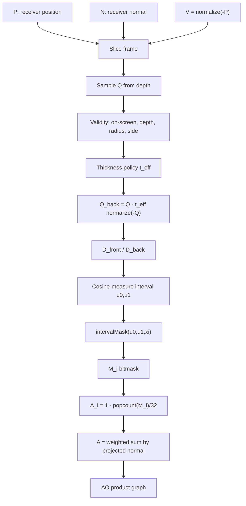

# Solver Whiteboard: Angular Visibility Intervals

This board is the working mental model for future VBAO work. It deliberately
puts math, shader code, evidence, and product quirks in one place.

## One-Line Model

```text
VBAO = local finite-thickness angular visibility intervals reduced through a
32-sector receiver mask, then reconstructed as scalar product AO.
```

## Canonical Flow



## Shader Landmarks

| Concept | Runtime landmark |
| --- | --- |
| phase atlas and stochastic thin intervals | `sampleNoisePhase(i, j)`, `vbaoSubsectorNoise` |
| sector interval mask | `intervalMaskStochasticFn` |
| base contact thickness | `baseThickness = min(this.thickness, maxThickness)` |
| near-sample thickness cap | `effectiveThickness = min(baseThickness, sampleDist * 0.85)` |
| sample-local back face | `samplePos - sampleViewDir * effectiveThickness` |
| cosine-measure projection | `vbaoCosineMeasureNoAtan` |
| point-sample mask accumulation | `occludedMask = occludedMask | validSampleMask` |
| popcount reduction | `1 - countOneBits(occludedMask) / 32` |
| projected-normal slice weight | `weightedAccessibility += sliceAccessibility * NprojLen` |

## Quirks As Equation Terms

| Quirk | Equation term | Why it happens | What a fix must prove |
| --- | --- | --- | --- |
| Near-contact collapse | `t_eff = min(t_base, d * 0.85)` | very near samples shrink the back interval | stronger contact without closing valid thin gaps |
| Broad-contact under-occlusion | `t_base = min(thickness, radius * 0.3)` | large contacts are capped before projection | broad walls darken without slabby thin blockers |
| Sector boundary shimmer | `intervalMask(u0,u1,xi)` | tiny changes cross 32-sector thresholds | lower variance without losing interval identity |
| One-hit stochastic sectors | `xi < intervalWidth * 32` | sub-sector intervals are probabilistic by design | confidence can distinguish weak support from stable occlusion |
| Phase tile residuals | phase atlas lookup | noise channels repeat spatially | less pattern without coupling slice/sample phases |
| Edge bleed | reconstruction neighborhood | scalar AO neighbors may be geometry-incompatible | edge metadata/confidence gates preserve discontinuities |
| Mud/halo | reconstruction kernel | polish can repair noise by smearing visibility | product improves without hiding raw failure |
| Formula drift | CDF + slice weighting | cosine measure can be double-counted or underweighted | fixtures prove the exact changed term |

## Solver Dependency Equation

```text
AO(P) =
  productReconstruct(
    scalarReduce(
      OR_samples(
        intervalMask(
          CDF_project(
            Q,
            Q - thicknessPolicy(P, Q, radius, contact) * normalize(-Q),
            N,
            V,
            S_i
          ),
          xi
        )
      )
    ),
    confidence(P),
    edgeCompatibility(P)
  )
```

This reads awkwardly because the real implementation is coupled. That is the
point. The correct simplification work is to name and test each term, not to
pretend the quirks are independent.

## Optimization Board

| Candidate | Solver term touched | Potential win | Cost/risk |
| --- | --- | --- | --- |
| Named thickness policy | `thicknessPolicy` | better contact/thin-gap balance | can over-darken thin blockers |
| Confidence sidecar | `confidence(P)` | targeted reconstruction, less blind polish | extra pass/target; private evidence only |
| Boundary-risk metadata | `intervalMask` support | explain sector instability | metadata may cost more than it saves |
| Edge metadata | `edgeCompatibility(P)` | less edge bleed and halo | another data path to validate |
| Phase atlas candidate | `xi` and sample phases | less pattern noise | easy to regress stochastic decorrelation |
| Same-cost sample shape | sample loop | better raw support | raw pass timing can climb quickly |
| 64-sector split mask | `M_i` resolution | lower angular quantization | two masks, more ops, not first move |
| Compute prepare | input/data shape | timing/observability for metadata | not useful unless it wins a named gate |

## Candidate Promotion Rule

Promote only if all are true:

```text
named solver term improved
AND named failure label improved
AND same-cost baseline included
AND thin-gap/contact/edge regressions absent
AND timing and screenshot evidence captured
AND public API remains compact
```

## What Not To Do

- Do not call this SPWI or world-space interval transport in repo artifacts.
- Do not add public knobs for internal solver terms before evidence proves user
  agency is needed.
- Do not use product polish to claim a raw kernel fix.
- Do not refactor the hot loop while changing math.
- Do not judge VBAO against N8AO smoothness without raw/reference rows.

## Next First Slice

The highest leverage first implementation slice is:

```text
reference/source fixture matrix
-> classify failures by solver term
-> pick one thickness or support candidate
-> compare raw/product evidence
```

That keeps the human in charge of the architecture and lets the implementation
follow the math.
