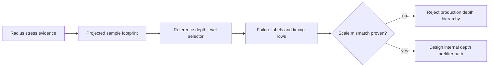

# Design: VBAO Depth Hierarchy Evidence Gate

## Architecture

This change adds a small reference module that maps a projected sample footprint
to a depth hierarchy level. It is not part of the public package surface and is
not wired into `VBAONode` production rendering.



## Reference Rule

The first gate uses a conservative MIP-style rule:

```txt
level = clamp(floor(log2(max(1, sampleFootprintPixels))), 0, maxLevel)
```

Sub-2px footprints stay on full-resolution depth. Larger footprints move to
coarser levels deterministically. The model is intentionally scalar and
history-free so it can be tested before any shader or render-target work.

## Constraints

- `VBAONodeOptions` must not grow.
- `index.ts` must not export the reference helper.
- Benchmark hooks may label future rows, but they must remain internal.
- Screenshots plus median/p95 timings are required before promotion.

## Alternatives

| Alternative | Tradeoff |
| --- | --- |
| Add TSL depth MIPs immediately | Faster visual experiment, but risks cargo-culting XeGTAO without local evidence. |
| Add bitmask confidence first | Better denoise signal, but does not answer large-radius single-depth instability. |
| Increase samples only | Already tested as insufficient for the current structured noise/mud failure. |

## Open Questions

- Which radius stress scene best isolates `scale-mismatch` from denoise failure?
- Does the existing TSL pass graph allow a simple depth prefilter, or would a
  WebGPU compute path be cleaner?
- Does adaptive thickness reduce enough large-radius mud that depth hierarchy
  becomes unnecessary?
