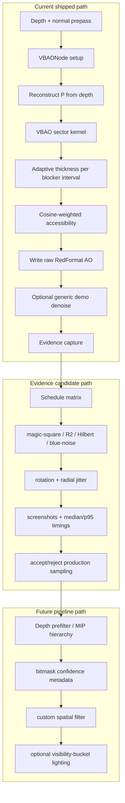

# VBAO Math Alignment Whiteboard

Date: 2026-05-25

## Goal

Align `VBAONode` with the practical GT-VBAO / VBAO++ direction seen in the
visibility-bitmask paper, CDRIN implementation notes, GTAO/XeGTAO production
practice, and the 80.lv/Ottosson experiments.

The current kernel is not obviously wrong. The verified issue is narrower and
more useful: the core visibility-bitmask contract is mostly aligned, but the
production-quality pieces that make other implementations look cleaner are not
yet part of the core path.

## North Star

**NS-01: Make VBAO read like geometric visibility, not like a dark screen-space
filter.**

The target is an AO/visibility pass where thin objects preserve light behind
them, thick continuous geometry occludes predictably, open gaps stay open, and
noise is removed without smearing contact detail. The renderer should be
calibrated against visible evidence, not tuned by random knob poking.

Success means:

- Thin occluders create narrow sector masks instead of GTAO-style wedge fill.
- Thick walls and large rocks produce stable, believable contact darkening.
- Half-resolution output is never judged without its matching upsample/denoise.
- Any denoise preserves geometric edges and does not hide bad sector math.
- Every visual claim has screenshot evidence and every cost claim has GPU timing.

## Improvement Labels

| Label | Name | What changes | Why it matters | First code target |
| --- | --- | --- | --- | --- |
| `IM-00` | Evidence harness | Capture raw/denoised GTAO, VBAO, and N8AO with fixed cameras | Stops us from arguing by taste | `EVIDENCE.md`, Museum route |
| `IM-01` | Adaptive thickness | Replace global blocker thickness with per-surface-run thickness | Main fix for muddy and binary gap artifacts | `vbaoReference.ts` first |
| `IM-02` | Thickness jitter | Stochastically scale adaptive thickness within a tight range | Breaks hard sector popping | Reference, then TSL |
| `IM-03` | Sampling schedule | Compare magic-square vs R2/Hilbert/blue-noise rotations | Reduces visible structured noise | Sampling helper / shader rotation |
| `IM-04` | Full-res quality path | Add an evidence preset that renders full-res without changing default | Fair comparison against polished references | Demo options / quality preset |
| `IM-05` | Bitmask-aware denoise | Filter accessibility using depth, normal, and mask confidence metadata | Cleans noise without washing edges | New denoise design + pass |
| `IM-06` | Depth hierarchy | Prefilter depth for larger-radius samples | Stabilizes distant and large-radius occluders | Internal prepass |
| `IM-07` | Visibility buckets | Evaluate lighting per open sector bucket | Moves from scalar AO toward GT-VBAO++ richness | Separate lighting experiment |

## Equation Labels

### `EQ-01` View Reconstruction

```txt
P = reconstructViewPosition(uv, depth, projectionMatrixInverse)
N = normalize(normalView(uv))
V = normalize(-P)
```

This is the coordinate contract. Everything below assumes view space.

### `EQ-02` Slice Frame

```txt
T0 = normalize(anyPerpendicular(V))
T1 = normalize(cross(V, T0))

phi_i = 2*pi*(i + rotation)/sliceCount
S_i   = normalize(cos(phi_i)*T0 + sin(phi_i)*T1)
```

Slices rotate around `V`. Do not rotate around `N`; that changes the algorithm.

### `EQ-03` Projected Normal Angle

```txt
gamma_i      = atan2(dot(N, V), dot(N, S_i))
gamma_i_norm = clamp(gamma_i, -pi/2, pi/2)
```

This is the cosine-weight anchor for the slice.

### `EQ-04` Constant-Thickness Blocker Interval

```txt
V_q     = normalize(-Q)
D_front = normalize(Q - P)
D_back  = normalize((Q - thickness * V_q) - P)

theta_front = atan2(dot(D_front, V), dot(D_front, S_side))
theta_back  = atan2(dot(D_back,  V), dot(D_back,  S_side))

theta0 = min(theta_front, theta_back)
theta1 = max(theta_front, theta_back)
```

This is the current repo model. Correct, but too blunt for varying occluder
sizes.

### `EQ-05` Adaptive Thickness

```txt
sameSurface(j, j-1) =
  abs(viewZ_j - predictedViewZ_j) < depthSlopeThreshold
  and dot(N_j, N_(j-1)) > normalContinuityThreshold
  and distanceVS(Q_j, Q_(j-1)) < maxSurfaceStep

runWidthVS        = length(project(Q_run_end - Q_run_start, S_side))
adaptiveThickness = clamp(runWidthVS * thicknessScale, minThickness, maxThickness)
jitteredThickness = adaptiveThickness * random(thicknessJitterMin, thicknessJitterMax)
```

`EQ-05` feeds `EQ-04` by replacing the uniform `thickness`.

### `EQ-06` Sector Range

```txt
theta_min = -pi/2
delta     = pi/32

k0 = floor((theta0 - theta_min)/delta)
k1 = ceil ((theta1 - theta_min)/delta)
M_i = M_i | maskRange(k0, k1)
```

`maskRange` remains count-clamped. No shift by 32, no shader UB.

### `EQ-07` Cosine-Weighted Accessibility

```txt
theta_k = (k + 0.5)*pi/32 - pi/2
w_k     = max(0, cos(theta_k - gamma_i_norm))

A_i = sum(open(M_i, k) * w_k) / max(sum(w_k), epsilon)
A   = pow(clamp(average(A_i), 0, 1), scale)
```

Output remains accessibility: `1` means open, `0` means blocked.

## Code Labels

### `CODE-01` Reference-first Adaptive Thickness

```ts
interface SurfaceRun {
  start: SampleHit
  end: SampleHit
  widthVS: number
}

function sameSurface(a: SampleHit, b: SampleHit, thresholds: ContinuityThresholds): boolean {
  const predictedDepth = b.viewZ + b.depthSlope * a.stepDelta
  return (
    Math.abs(a.viewZ - predictedDepth) < thresholds.depth &&
    dot3(a.normal, b.normal) > thresholds.normalDot &&
    distance3(a.position, b.position) < thresholds.maxStepVS
  )
}

function estimateAdaptiveThickness(run: SurfaceRun, settings: AdaptiveThicknessSettings): number {
  const base = clamp(run.widthVS * settings.scale, settings.min, settings.max)
  return base * settings.jitter
}
```

This must land in the scalar reference before shader code. If the reference
cannot explain it, the shader should not ship it. Es así de fácil.

### `CODE-02` Shader-side March Skeleton

```ts
for each slice i:
  M_i = 0u

  for side in [-1, +1]:
    run = empty

    for sample j:
      Q_j, N_j = sampleScene(j)
      if background: continue

      if run.empty or sameSurface(Q_j, run.last):
        run.extend(Q_j, N_j)
      else:
        M_i |= emitRunMask(run)
        run = startRun(Q_j, N_j)

    if run.notEmpty:
      M_i |= emitRunMask(run)

  A += cosineWeightedAccessibility(M_i, gamma_i_norm)
```

The shader must preserve the current mirrored march and only replace how
thickness is chosen for the blocker interval.

### `CODE-03` Denoise Metadata Candidate

```ts
coverage   = popcount(M_i) / 32
transition = popcount(M_i ^ rotateLeft(M_i, 1)) / 32
confidence = saturate(1 - transition * transitionPenalty)
```

The metadata candidate is not a commitment. It is the thing to test before
changing render-target format.

## Reference Inputs

| Reference | What it contributes | Design impact |
| --- | --- | --- |
| Therrien et al., Screen Space Indirect Lighting with Visibility Bitmask | 32-sector visibility mask, fixed-thickness blockers, visibility beyond thin surfaces | Keep the bitmask model and sector interval construction |
| CDRIN SSAO using Visibility Bitmasks notes | Shows how to adapt a GTAO horizon loop into sector updates; no distance falloff needed when using bitmask + thickness | Keep distance falloff out of core VBAO math |
| Activision GTAO / GTSO memo | Radiometrically grounded AO, practical spatio-temporal distribution, denoise/temporal expectations in production | Do not judge raw single-frame output against polished GTAO without matching filtering |
| XeGTAO | Depth prefilter/MIPs, full-resolution defaults, 3 slices / 6 samples, spatial denoise plus TAA when available | Add depth hierarchy and denoise as explicit phases, not hidden tweaks |
| AMD FidelityFX CACAO | Adaptive sampling AO, multiple quality/performance levels, and practical sensitivity to normal quality | Treat normal correctness and preset tradeoffs as evidence inputs, not afterthoughts |
| 80.lv / Ottosson GT-VBAO experiment | Distant light evaluated per visibility bucket, occluder thickness estimated from consecutive horizon samples, randomized thickness scaling | Add adaptive thickness and bucket lighting to roadmap |
| Local repo ADR-011 | Raw-first policy, denoise requires screenshot/timing evidence and formula | Any denoise work must update evidence and math docs first |
| Local repo ADR-012 | Benchmark harness direction with GTAO, VBAO, N8AO; XeGTAO is not a toggle | Compare algorithms in a controlled route before porting big systems |

## Alignment Matrix

| Math / pipeline area | Current repo state | Target alignment | Gap | Priority |
| --- | --- | --- | --- | --- |
| Sector representation | Fixed `SECTOR_COUNT = 32`; u32 mask | Matches visibility-bitmask AO | No gap | Keep |
| Slice basis | Slices rotate around `V = normalize(-P)`, not around `N` | Matches CDRIN / paper framing | No obvious gap | Keep |
| Normal input | `normalNode` required; no depth-derived fallback | Correct for stable projected-normal weighting | No gap | Keep |
| Sector interval | Front and back horizon angles mark bit ranges | Matches bitmask blocker model | Need more parity against rendered GPU inputs | P1 |
| Thickness model | Constant uniform, default 0.25 | Adaptive per-blocker thickness from surface continuity | Constant thickness causes muddy darkening and binary gap artifacts | P0 |
| Thickness jitter | None in core | Small stochastic scaling to reduce binary breakup | Current binary intervals can pop/noise around thin gaps | P0 |
| Falloff | No GTAO distance falloff heuristic | Correct for pure visibility-bitmask model | No gap, but radius still needs calibration | Keep |
| Reduction | Cosine-weighted accessibility, popcount only reference | Good production AO-only formula | Need confirm against visual reference captures | P1 |
| Sampling pattern | 5x5 magic-square rotation, frame invariant | Hilbert/R2/blue-noise/spatio-temporal distribution options | Deterministic pattern can look structured or noisy | P0 |
| Resolution | Balanced defaults half-res | Full-res quality path plus robust upsample/filtering | Half-res raw AO looks unfairly muddy vs references | P0 |
| Depth sampling | Direct depth reads only | Depth MIP/prefilter for large-radius sampling | Large steps alias and overreact to single depth texels | P1 |
| Denoise | Core raw-first; demo has optional Three `DenoiseNode` | Evidence-gated depth/normal-aware denoise, ideally bitmask-aware | Raw output compared to denoised references is misleading | P0 |
| Temporal stability | No temporal accumulation | Optional history/TAA integration with rejection | Single-frame grain persists | P2 |
| Edge metadata | G channel reserved but unused | Store confidence, coverage, or transition density for denoise | Denoiser lacks bitmask-specific edge cues | P1 |
| Directional lighting | AO-only scalar accessibility | Evaluate distant/ambient light per open bucket | Other GT-VBAO demos look richer because they are not only scalar AO | P2 |
| Benchmarking | ADR-012 route direction exists | Captured screenshots and GPU timings at pinned cameras | Visual claims still need evidence | P0 |

## Production AO Lessons

| Lesson | XeGTAO / CACAO signal | VBAO action |
| --- | --- | --- |
| Pipeline discipline beats one-off tuning | XeGTAO separates depth prefilter, AO main pass, and denoise; CACAO presents quality/performance tiers | Keep evidence, kernel, denoise, and preset work as separate SDD changes |
| Full resolution is a real baseline | XeGTAO documents a full-resolution high preset | Capture full-res raw VBAO before calling the kernel muddy |
| Spatial denoise can be non-temporal | XeGTAO documents 5x5 depth-aware spatial denoise, with TAA as optional help | Design a spatial-only filter first; no history dependency in this track |
| Sampling schedule matters | XeGTAO uses Hilbert/R2 and discusses blue-noise tradeoffs | Compare current 5x5 magic-square against R2/Hilbert/blue-noise before hiding pattern noise |
| Source normals can dominate AO correctness | CACAO sample notes incorrect normals can make AO wrong | Add normal quality/consistency to evidence notes when a failure is classified |
| Thin occluders are a geometry proxy problem | XeGTAO calls out the depth-buffer height-field limitation and thin-occluder compensation | Keep adaptive thickness separate from denoise; a filter cannot make bad blocker intervals correct |
| Quality tiers need measured contracts | CACAO exposes multiple quality/performance settings | Avoid new public knobs until evidence ties them to screenshot and timing wins |

## Non-Temporal Denoise Gate

The denoise north star is a spatial-only edge-aware filter. No TAA, no motion
vectors, no history buffer:

```text
A_filtered(p) =
  sum(q in N(p)) W(p, q) * A_raw(q)
  -----------------------------------
        sum(q in N(p)) W(p, q)

W(p, q) =
  K_spatial(|p - q|)
* K_depth(|z_p - z_q|)
* K_normal(1 - dot(n_p, n_q))
* K_confidence(c_p, c_q)
```

Start with `K_confidence = 1`. Only add VBAO confidence metadata if the
depth/normal baseline fails a named evidence case.

| Gate | Pass condition | Rejection signal |
| --- | --- | --- |
| Evidence first | `EVIDENCE.md` rows classify noise/mud/halo/thin-gap/edge-bleed/scale-mismatch | Denoise work starts from a visual vibe |
| Full-res baseline | Full-resolution raw VBAO is captured beside half-res raw | Half-res blur is misdiagnosed as kernel mud |
| Edge preservation | Noise drops without closing thin gaps | Filter creates edge bleed or waxy contact shadows |
| Cost honesty | Raw, denoised, and higher-sample raw timings are recorded | Filter is cheaper only because the comparison is unfair |
| API restraint | Demo/internal option only until proof | New public denoise knob appears before the formula wins |

## Evidence Alignment Pipeline



## Math Contract

### View-space inputs

```txt
P = reconstructed view-space position from depth
N = normalize(view-space normal)
V = normalize(-P)
```

### View-local slice frame

```txt
T0 = normalize(anyPerpendicular(V))
T1 = normalize(cross(V, T0))

phi_i = 2*pi*(i + rotation)/sliceCount
S_i   = normalize(cos(phi_i)*T0 + sin(phi_i)*T1)
```

Keep this. Slices are around the view vector, not the surface normal. That is
the architectural foundation. If we rotate around `N`, the projected normal
math is a different building. Same bricks, wrong blueprint.

### Projected normal angle

```txt
gamma_i = atan2(dot(N, V), dot(N, S_i))
gamma_i_norm = clamp(gamma_i, -pi/2, pi/2)
```

### Current blocker interval

For a sampled surface point `Q`:

```txt
V_q     = normalize(-Q)
D_front = normalize(Q - P)
D_back  = normalize((Q - thickness * V_q) - P)

theta_front = atan2(dot(D_front, V), dot(D_front, S_side))
theta_back  = atan2(dot(D_back,  V), dot(D_back,  S_side))

theta0 = min(theta_front, theta_back)
theta1 = max(theta_front, theta_back)
```

This is correct for constant-thickness VBAO. It is not enough for varied scene
scale. That is the important distinction.

### Target adaptive-thickness interval

Estimate whether samples along the same side/slice belong to one continuous
surface:

```txt
sameSurface(j, j-1) =
  abs(viewZ_j - predictedViewZ_j) < depthSlopeThreshold
  and dot(N_j, N_(j-1)) > normalContinuityThreshold
  and screenDistance(Q_j, Q_(j-1)) < maxSurfaceStep
```

Then estimate thickness from the contiguous run width:

```txt
runWidthVS = estimateViewSpaceRunWidth(Q_run_start, Q_run_end, S_side)
adaptiveThickness = clamp(runWidthVS * thicknessScale, minThickness, maxThickness)
jitteredThickness = adaptiveThickness * random(thicknessJitterMin, thicknessJitterMax)
```

Use `jitteredThickness` in the current blocker interval formula. This preserves
the existing bitmask math while replacing the one-size-fits-all thickness
parameter.

### Sector update

```txt
theta_min = -pi/2
delta     = pi/32

k0 = floor((theta0 - theta_min)/delta)
k1 = ceil ((theta1 - theta_min)/delta)

mask = mask | maskRange(k0, k1)
```

`maskRange` must remain count-clamped. No clever shifts by 32. That rule exists
because shader undefined behavior is where nice renderers go to become haunted.

### Cosine-weighted accessibility

```txt
for each sector k:
  theta_k = (k + 0.5)*pi/32 - pi/2
  w_k = max(0, cos(theta_k - gamma_i_norm))

  denominator += w_k
  if bit(mask, k) == 0:
    numerator += w_k

A_i = numerator / max(denominator, 1e-6)
A   = average(A_i over slices)
out = pow(clamp(A, 0, 1), scale)
```

Keep scalar output as accessibility: `1` open, `0` blocked.

## Innovations To Add

| Innovation | Why | Tradeoff | Entry evidence |
| --- | --- | --- | --- |
| Adaptive thickness from same-surface runs | Fixes muddy occluders and binary gaps caused by constant thickness | More per-sample state and tuning thresholds | Side-by-side thin fence, rocks, building edges |
| Thickness stochastic scaling | Reduces hard binary artifacts when gaps open behind blockers | Can become noise if no denoise exists | Raw and denoised AO-only frames |
| Bitmask-aware denoise | Cleans raw grain without washing geometry edges | Extra pass and new math contract | GPU timings raw vs denoised vs higher samples |
| Depth prefilter/MIPs | Stabilizes large-radius samples and reduces single-texel overreaction | Extra prepass and memory | Large-radius scene, distant creases |
| Sampling schedule upgrade | Removes visible 5x5 structure and improves convergence | Temporal variant needs rejection | Static and camera-motion comparisons |
| Edge/confidence metadata | Gives denoise useful signal beyond depth/normal | Requires render target format/API decision | Denoise preserves edges better than generic filter |
| Visibility-bucket lighting | Moves beyond scalar AO into the richer GT-VBAO look | Larger scope, lighting API design | Distant light sample scene |

## Roadmap

### Phase 0 - Evidence Baseline

Outcome: know exactly where raw VBAO fails before changing math.

- [ ] Capture raw GTAO, raw VBAO, denoised VBAO, and N8AO on the Museum route.
- [ ] Capture AO-only and beauty at 1920x1080 and 1280x720.
- [ ] Use pinned cameras where available.
- [ ] Record GPU timings for raw VBAO and denoised VBAO.
- [ ] Add failure screenshots to `EVIDENCE.md`.
- [ ] Classify failures as noise, mud, halo, thin-gap artifact, edge bleeding, or scale mismatch.

### Phase 1 - Adaptive Thickness Prototype

Outcome: fix the main muddy/weird blocker model.

- [ ] Add JS reference helpers for same-surface run detection.
- [ ] Add tests for isolated thin occluder, continuous thick wall, and gap-behind-object cases.
- [ ] Prototype adaptive thickness in the scalar reference first.
- [ ] Define clamp defaults: `minThickness`, `maxThickness`, `thicknessScale`.
- [ ] Add optional stochastic thickness scale in reference.
- [ ] Port adaptive thickness to TSL only after reference tests prove behavior.
- [ ] Compare against constant-thickness output in screenshots.

### Phase 2 - Sampling And Resolution

Outcome: reduce visible patterning before hiding it with filters.

- [ ] Add a sampling-pattern abstraction in the reference tests.
- [ ] Compare current 5x5 magic-square, R2, Hilbert, and blue-noise rotations.
- [ ] Add a full-resolution quality preset for evidence, even if not default.
- [ ] Validate half-res output only with an explicit denoise/upsample path.
- [ ] Keep fallback deterministic for non-temporal mode.

### Phase 3 - Denoise With Formula

Outcome: production-grade output without violating ADR-011.

- [ ] Write denoise formula before shader code.
- [ ] Start with depth/normal-aware spatial denoise using Three `DenoiseNode` as baseline.
- [ ] Evaluate a VBAO-specific filter using mask coverage and transition density.
- [ ] Decide whether the G channel stores edge confidence, coverage, or transition density.
- [ ] Add GPU timings for raw, higher-sample raw, generic denoise, and bitmask-aware denoise.
- [ ] Document when denoise is enabled in demos and comparisons.

### Phase 4 - Depth Hierarchy

Outcome: stabilize larger radii and distant occluders.

- [ ] Add a depth prefilter/MIP design note.
- [ ] Decide whether TSL render targets are enough or WebGPU compute is needed.
- [ ] Add reference cases where direct depth samples fail.
- [ ] Implement depth hierarchy behind an internal path, not as a renamed GTAO knob.
- [ ] Capture radius stress tests.

### Phase 5 - Directional Visibility Buckets

Outcome: move from AO-only toward the richer GT-VBAO++ look.

- [ ] Define sector-to-direction reconstruction for lighting buckets.
- [ ] Estimate distant light contribution from open sectors.
- [ ] Keep scalar AO path intact and optional.
- [ ] Add debug view for bucket directions / bucket visibility.
- [ ] Compare against AO-only in scenes with strong directional ambient.

## Concrete Task Breakdown

### P0 Tasks

- [ ] Create `EVIDENCE.md` entries for current raw VBAO failures.
- [ ] Add an adaptive-thickness proposal/spec before code.
- [ ] Add scalar reference tests for adaptive thickness.
- [ ] Add denoise math proposal that satisfies ADR-011.
- [ ] Decide whether Museum denoise remains demo-only or graduates into a core option.
- [ ] Add a full-res VBAO comparison preset to the benchmark route.

### P1 Tasks

- [ ] Add mask metadata helpers to shader output design.
- [ ] Prototype R2/Hilbert sample rotation.
- [ ] Add depth-MIP design.
- [ ] Expand parity tests with GPU-readback inputs from the actual scene pass.
- [ ] Add screenshots for radius/thickness sweeps.

### P2 Tasks

- [ ] Temporal accumulation and rejection.
- [ ] Visibility-bucket distant lighting.
- [ ] Specular occlusion / GTSO-adjacent exploration.
- [ ] WebGPU compute port evaluation.

## Open Decisions

| Decision | Options | Recommendation |
| --- | --- | --- |
| Where adaptive thickness lives | Core `VBAONode` only, demo experiment first, or reference-only first | Reference-only first, then TSL. Concepts before code, hermano. |
| Public API | Add knobs now or keep internal constants | Keep internal until evidence proves defaults. Avoid shipping tuning soup. |
| Denoise path | Generic Three `DenoiseNode` or custom bitmask-aware filter | Use Three as baseline, custom only if screenshots prove value. |
| Metadata channel | Keep `RedFormat`, switch to RG, or separate target | Switch only when denoise formula names the required metadata. |
| XeGTAO port | Full compute-style port or no port | Full port only. A renamed GTAO preset is fake progress. |

## Definition Of Done

- Math changes have scalar reference tests before TSL changes.
- Visual claims have side-by-side screenshots.
- Performance claims have GPU timings.
- Denoise has a written formula before implementation.
- Any new public knob is justified by evidence, not vibes.
- `VBAONode` remains accessibility output unless a separate lighting path is explicitly introduced.
