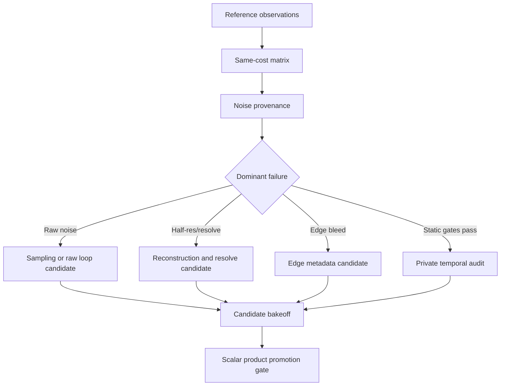

# Research Audit: VBAO Product Quality Hardening 10x

## Purpose

This audit translates current external AO practice and local source truth into
the next SDD slice. The intent is not to reject the larger 5.5 Pro direction.
It is to keep the useful wind: bitmask visibility, confidence/support metadata,
same-cost quality pressure, edge-aware reconstruction, and temporal discipline,
while preventing private experiments from becoming public product claims too
early.

## External Research Translation

### SSILVB / VBAO

The paper's useful product lesson is that the bitmask is visibility state, not a
temporary approximation to collapse away as soon as the first scalar AO value is
available. Replacing two horizon angles with sector visibility gives room to
represent thin surfaces, multiple visibility intervals, and light passing behind
constant-thickness occluders.

Local translation:

- preserve the 32-sector visibility bitmask as the receiver truth source;
- use confidence/support metadata to explain when the scalar reduction is weak;
- keep directional/bucketed output reference-only until scalar AO passes product
  gates.

### ASSAO

ASSAO's relevant pattern is a production pipeline, not a formula to copy:
prepare depth, optionally use MIP/deinterleaved structure, compute AO and edge
information, then run edge-aware blur/combine so filtering does not bleed across
geometry boundaries.

Local translation:

- do not add blind smoothing as the next fix;
- separate raw AO, edge/receiver compatibility, reconstruction, resolve, and
  polish timing;
- use edge metadata only when the noise gate proves edge bleed is the remaining
  blocker.

### CACAO

CACAO's relevant pressure is adaptive cost: higher quality spends samples where
an importance map says the image needs them, and exposes bilateral/sharpness
controls internally as quality knobs.

Local translation:

- confidence/support data must earn its cost against same-cost raw sampling;
- use the confidence lane to decide where reconstruction can act, not as public
  API;
- compare candidate overhead against `same-cost-3x10`, `same-cost-2x16`, and
  full-res controls before promoting it.

### SVGF

SVGF's relevant lesson is that temporal accumulation is only credible when
history is validated and variance/edge stopping decide where filtering is safe.
Temporal is not a substitute for proving the static signal.

Local translation:

- public VBAO remains temporal off;
- velocity-backed temporal stays private until motion, disocclusion, and
  variance-like diagnostics exist;
- temporal cannot be used to hide static hatch/stripe noise.

### XeGTAO

XeGTAO's relevant lesson is evidence discipline. Its documented tuning compares
screen-space AO against ray-traced ground truth across scenes and locations, then
uses aggregate error to select heuristics. It also defaults to a spatial path
that can be used without TAA, while treating temporal noise as something that
must remain low enough for host TAA to classify correctly.

Local translation:

- reference observations must precede promotion;
- screenshot proxies are useful steering signals, not ground truth;
- same-cost spatial controls are required before temporal or adaptive claims;
- sampling distribution changes are fair candidates only when measured against
  the reference and same-cost matrix.

## Local Audit

### What Already Exists

- `VBAONode` already has a 32-sector receiver model, phase-atlas sampling,
  private confidence-guided reconstruction, half-res cleanup, full-res polish,
  pass timing labels, and scalar public output.
- `vbaoSampling.ts` already separates phase channels and uses near-biased sample
  spacing, so the next work should measure sampling attribution before changing
  loop shape.
- `VBAOHalfResCleanupNode` and `VBAOFullResPolishNode` already use confidence
  and depth/normal compatibility, so "add denoise" would duplicate existing
  behavior unless the failure source is named.
- `aoProductionReferenceGate` already defines the required fixture family and
  fails missing observations closed.
- `productionReport.mjs` already tracks candidate labels, pass timing,
  `noise`, `edge-bleed`, compute inventory, private lanes, and promotion
  verdict rows.

### Gaps

1. Reference observations are still the earliest blocker. Without required
   fixture observations, screenshots can guide but cannot promote the product.
2. Noise provenance is ambiguous. The current reports can label `noise`, but
   they do not yet prove whether the dominant source is raw sampling, half-res
   resolve, cleanup, or polish.
3. Confidence-guided reconstruction is plausible but not proven. It must beat
   same-cost raw sampling and full-res controls.
4. Edge metadata is not yet justified. Current bilateral weights reuse
   depth/normal compatibility at filter taps, but there is no named edge/support
   metadata target with lifetime, format, owner, and timing.
5. Temporal is a later private gate. It should not replace static quality work.

### Current Evidence Read

The latest tracked 2560x1440 continuity rows are not promotable and predate
matrix classification:

| Row | Pattern/noise | Stripe | Edge proxy | Thin-gap proxy | Total GPU | Read |
| --- | ---: | ---: | ---: | ---: | ---: | --- |
| `product-preset` | 0.07012 | 0.10459 | 0.06653 | 0.01464 | 4.823ms | baseline candidate, still `noise,edge-bleed` |
| `same-cost-3x10` | 0.07027 | 0.10367 | 0.06682 | 0.01479 | 4.930ms | nearly flat versus product-preset |
| `same-cost-2x16` | 0.06580 | 0.09836 | 0.05914 | 0.01355 | 5.186ms | improves noise/edge proxies but costs more and reduces thin-gap proxy |
| `spatial-ultra` | 0.07027 | 0.10375 | 0.06673 | 0.01467 | 6.127ms | poor value as a product direction |

The temporal verdict remains `reject-promotion`: clean-checkout reproducibility
is not proven, velocity-backed internal evidence exists only as incomplete
private smoke, motion/disocclusion gates are incomplete, and stripe regression
remains.

These rows predate the new product-quality matrix report section. Treat them as
planning input until regenerated artifacts carry matrix classification,
reference status, pass timing, and screenshot metrics together.

## What This Replaces

This replaces the legacy mental model of "find the next impressive subsystem"
with a gate model:

The old shape asks, "Which advanced lane do we like?" The new shape asks,
"Which failing gate identifies the cheapest honest fix?"

## How To Address It

### Phase 0: Freeze The Matrix

Record the exact product candidate and controls before touching code:

- scalar-control;
- confidence-guided candidate;
- same-cost raw sample controls;
- full-res product;
- compute off;
- compute smoke as observability only;
- temporal off;
- velocity temporal as private evidence only.

### Phase 1: Attach Reference Truth

Make product reports carry required fixture observations. Missing fixture data
must remain `missing-reference-observation`, not "candidate-only" optimism.

### Phase 2: Prove Same-Cost Value

Compare confidence-guided reconstruction against raw samples at similar cost.
If same-cost samples win, keep confidence private and spend effort on sampling.
If confidence wins without new labels, keep it as the product candidate.

### Phase 3: Attribute Noise

Capture or report raw, cleanup, resolve, polish, and final product rows clearly
enough to tell where hatch/stripe noise appears. Do not tune multiple knobs in
one run.

### Phase 4: Add Edge Metadata Only If Needed

If noise improves but `edge-bleed` remains, define an edge/support metadata
target before runtime use:

- semantics;
- format;
- lifetime;
- backend;
- owner;
- consuming stages;
- pass timing.

### Phase 5: Keep Temporal Private

Only audit velocity temporal after the static product gates stop failing.
Temporal needs motion/disocclusion evidence and variance-like diagnostics before
it can become a candidate.

## Audit Verdict

Candidate worth keeping: yes, as a private lane.

Candidate promotable now: no.

Earliest blocking gate: required reference observations plus frozen same-cost
controls.

Most likely next implementation: report/reference harness hardening and
same-cost matrix capture, then either sampling/noise attribution or edge
metadata depending on the measured dominant failure.

This is the stricter version of taking the proposal seriously. We keep the
right ideas, but make each one buy its way into the product with evidence.

## Sources

- SSILVB / VBAO paper: https://arxiv.org/abs/2301.11376
- Intel ASSAO: https://www.intel.com/content/www/us/en/developer/articles/technical/adaptive-screen-space-ambient-occlusion.html
- AMD FidelityFX CACAO: https://gpuopen.com/manuals/fidelityfx_sdk/techniques/combined-adaptive-compute-ambient-occlusion/
- AMD FidelityFX CACAO SDK pass reference: https://gpuopen.com/manuals/fidelityfx_sdk/reference_documentation/sdk/effect_components/fidelityfx_cacao/ffx_cacao/
- NVIDIA SVGF: https://research.nvidia.com/labs/rtr/publication/schied2017spatiotemporal/
- Intel XeGTAO: https://github.com/GameTechDev/XeGTAO
