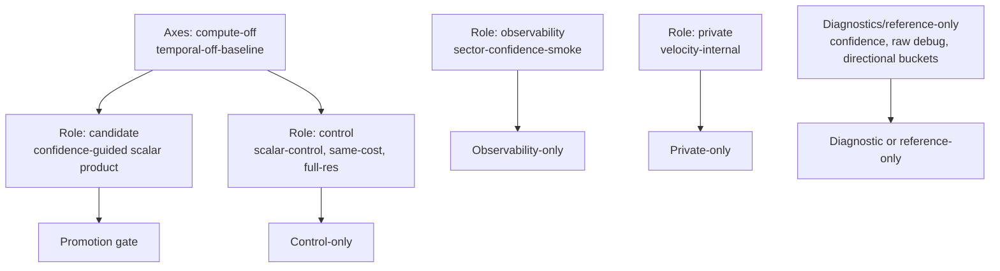

# SDD Plan: VBAO Product Quality Hardening 10x

## Current Truth

Architecture: 8/10. The receiver-solver model is coherent, private lanes are
separated, and public API boundaries are guarded.

Evidence discipline: 7/10. Captures, pass timings, candidate labels, and target
inventory are now present for the recent lanes.

Rendered product quality: 5/10. The scalar control is too washed out, and the
confidence-guided candidate reveals useful structure but still carries obvious
noise and visible hatch/stripe artifacts.

Promotion readiness: 3/10. Current rows are blocked by `noise`,
`missing-reference-observation`, incomplete threshold gates, and candidate-only
status.

## Revised Decision Snapshot

External practice supports the stricter gate order in this SDD. SSILVB/VBAO
justifies preserving the bitmask receiver model. ASSAO and CACAO both separate
AO generation from edge-aware filtering, application, and upscale stages.
CACAO's adaptive path also treats extra cost as something that must be spent
where an importance signal proves value. SVGF keeps temporal credible only when
history and variance-style evidence are valid. XeGTAO tunes heuristics against
ray-traced reference instead of screenshots alone.

Local evidence points to the same order:

- reference observations are still the first hard blocker;
- captured markdown reports predate the new product-quality matrix output and
  need regeneration before final packaging decisions;
- `same-cost-2x16` improves pattern, stripe, and edge proxies, but costs more
  and reduces thin-gap proxy, so it is a useful control, not a product decision;
- `spatial-ultra` is a negative control for now because its cost increase does
  not buy a material image-quality change;
- temporal remains rejected because current evidence is not clean-checkout
  reproducible, velocity-backed evidence exists only as incomplete private smoke,
  and stripe regression remains.

Decision implication: do not jump to temporal, compute, edge metadata, public
API, or release claims. Normalize the report evidence, attach reference truth,
then run the same-cost matrix before choosing sampling, reconstruction, or edge
metadata as the next implementation slice.

## North Star

Ship one scalar AO product path that looks clean in Museum/Lab evidence,
preserves contact and thin gaps, has measured pass cost, and matches required
reference observations. Private candidate lanes may help, but public output
stays scalar.

## Candidate And Controls



The candidate wins only if it beats controls on visible labels and metrics at
the same or justified cost. A more interesting graph is not a win.

## Phase 0: Baseline Freeze

Goal: define the exact rows used for comparison.

Deliverables:

- freeze the candidate and control matrix;
- record existing screenshot metrics and pass timings;
- regenerate product reports that predate the matrix section before relying on
  them for final decisions;
- define pass-cost budget for candidate overhead;
- ensure row labels distinguish candidate, control, private, diagnostic, and
  observability roles plus compute, temporal, and same-cost axes.

Acceptance:

- every row has screenshot path, resolution, view, pass timings, labels, and
  candidate/control classification;
- no row with missing reference observations can pass.

## Phase 1: Reference Observation Gate

Goal: remove `missing-reference-observation` as the first promotion blocker.

Required fixtures:

- `flat-plane-open`;
- `box-contact`;
- `two-wall-corner`;
- `broad-wall-contact`;
- `thin-gap-separated-slabs`;
- `grazing-surface-wall`;
- `normal-sensitive-side-contact`.

Acceptance:

- product rows report observed fixture coverage;
- missing fixtures fail closed;
- screenshot proxies remain secondary evidence.

## Phase 2: Same-Cost Matrix

Goal: decide whether confidence-guided reconstruction earns its cost.

Compare:

- scalar-control;
- confidence-guided candidate;
- product-preset with extra raw samples matching confidence overhead;
- full-res product control;
- compute-smoke only as inventory/observability, not quality promotion.

Acceptance:

- same resolutions: 1920x1080 and 1280x720;
- same scene/view coverage;
- include any legacy 2560x1440 rows only as continuity evidence, not as the
  release matrix;
- pass timing separates raw, confidence, cleanup, resolve, polish, compute;
- candidate must reduce a named blocking label or beat same-cost samples.

## Phase 3: Noise Kill Gate

Goal: kill visible hatch/stripe noise before adding more subsystems.

Allowed investigations:

- sample phase or raw sample schedule changes;
- reconstruction strength changes guided by confidence;
- full-res or higher raw sample same-cost controls;
- edge-aware metadata only if Phase 4 proves the edge need.

Acceptance:

- one knob changes per run unless the artifact explicitly declares a coupled
  experiment;
- `noise` and stripe metrics improve without introducing `mud`, `halo`,
  `thin-gap`, `edge-bleed`, `false-curvature`, or `scale-mismatch`;
- screenshots visually confirm metric movement;
- no default product claim changes until reference gates pass.

## Phase 4: Edge Metadata Gate

Goal: attack `edge-bleed` with named receiver compatibility data instead of
more blind filtering.

Deliverables:

- define the metadata target shape and lifetime;
- identify consuming stages: cleanup, resolve, polish, or all;
- add reference/source tests before runtime use;
- compare against equivalent pass-cost alternatives.

Acceptance:

- edge metadata replaces repeated depth/normal compatibility ambiguity;
- target format, lifetime, backend, and timing are recorded;
- edge metrics improve without worse noise or thin-gap behavior.

## Phase 5: Product Candidate Bakeoff

Goal: choose one candidate or reject all current candidates.

Decision table:

| Result | Meaning |
| --- | --- |
| `promote-private-candidate` | Candidate clears labels, reference, and same-cost gates but public API remains scalar. |
| `keep-control` | Scalar-control or current product remains best; confidence stays private. |
| `try-edge-metadata` | Noise is acceptable but edge bleed blocks promotion. |
| `try-sampling` | Noise dominates and reconstruction cannot fix it. |
| `reject-current-candidates` | Candidates add cost/complexity without product quality. |

Acceptance:

- decision is based on tracked artifacts;
- decision records the dominant blocker and the cheapest credible next fix;
- rejected candidates are recorded with measured reasons;
- no README or EVIDENCE release claim unless release gates pass.

## Phase 6: Release Claim Gate

Goal: decide whether product docs can change.

Required before any claim:

- tracked screenshots at both evidence resolutions;
- GPU pass timings;
- complete reference observations;
- threshold gates complete;
- no blocking failure labels;
- clean-checkout reproducibility.

Acceptance:

- `EVIDENCE.md` is updated only after the gate passes;
- README remains explicit about incomplete readiness until then.

## Verification

Focused checks:

```sh
pnpm --filter @horizonao/core exec vitest run --root ../.. packages/horizon-ao/src/__tests__/vbaoNodeSource.test.ts packages/horizon-ao/reference/__tests__/aoProductionReferenceGate.test.ts
pnpm --filter @horizonao/demo test -- scripts/profiling/productionReport.test.mjs
pnpm --filter @horizonao/core typecheck
pnpm --filter @horizonao/demo typecheck
git diff --check -- openspec/changes/vbao-product-quality-hardening-10x
```

Benchmark families:

```powershell
$env:AO_BENCHMARK_MODES='vbao'
$env:AO_BENCHMARK_VIEWS='ao'
$env:AO_BENCHMARK_DENOISE_STATES='true'
$env:AO_BENCHMARK_VBAO_TEMPORAL_MODE='off'
$env:AO_BENCHMARK_VBAO_COMPUTE_CANDIDATE='off'
$env:AO_BENCHMARK_VBAO_RECEIVER_CONFIDENCE='confidence-guided'
pnpm --filter @horizonao/demo benchmark:ao
$env:AO_BENCHMARK_VBAO_RECEIVER_CONFIDENCE='scalar-control'
pnpm --filter @horizonao/demo benchmark:ao
```

Add same-cost sample controls only after Phase 0 freezes the exact row matrix.

## What Must Not Be Promoted Yet

- confidence as public API;
- compute as product path;
- velocity temporal;
- directional buckets or bent normals;
- release-ready README language;
- screenshots without reference observations.
