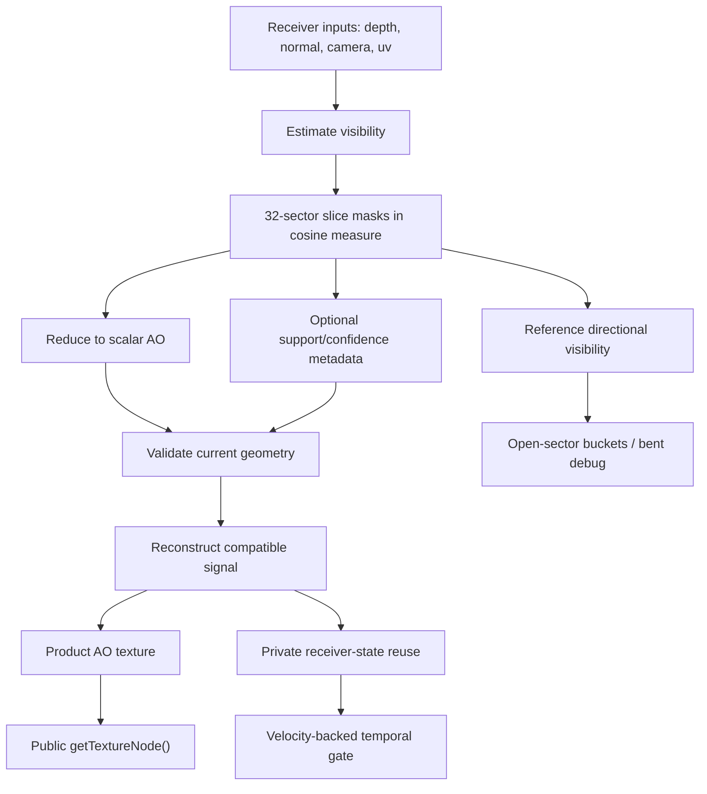

# Design: VBAO Receiver Visibility Solver

## Principal Decision

The internal architecture is receiver-state first.

```text
Receiver = current surface point plus local geometric contract.
ReceiverState = compact visibility estimate plus optional trust metadata.
```

Current v1 receiver state is scalar:

```text
R = accessibility / AO
```

The next useful internal receiver state is:

```text
R = accessibility / AO
G = confidence or support
```

The later high-fidelity state is:

```text
mask or support mask
AO
confidence
optional open-sector moments or buckets
```

Do not start from the later state. Start by refactoring the product graph and
evidence vocabulary so the current scalar path already behaves like a receiver
solver.

## Architecture Diagram



## Receiver Contract

The receiver contract has four layers.

### Surface Validity

The receiver must have valid depth, normal, camera reconstruction, and viewport
coordinates. Invalid receiver data outputs unoccluded accessibility.

### Locality

Samples are trusted only when they are local to the receiver and lie on the
marched side. This preserves the existing radius and thickness gates, but names
them as receiver compatibility rather than post-effect heuristics.

### Visibility Measure

The bitmask stores quantized visibility measure. The current production contract
is still:

```text
32 sectors
cosine-measure CDF remap
point-sample sector quantization
popcount accessibility
projected-normal slice weighting
```

That stays. The new model changes ownership, not the formula.

### Trust Metadata

Confidence/support is the first metadata extension because it can tell
reconstruction how much to trust raw visibility.

Candidate ingredients:

- valid sample ratio;
- stochastic sub-sector rate;
- mask saturation;
- sector support count or broad interval support;
- edge compatibility;
- slice agreement.

Only include a term if it can be observed, tested, and used to reduce a named
failure label or pass cost.

The first reference semantics use receiver support and slice agreement:

```text
confidence = sqrt(receiver support * slice agreement)
```

Support is receiver-compatible samples divided by candidate samples. Slice
agreement is consistency of reduced per-slice accessibility. Darkness itself is
not confidence; supported open visibility, unsupported open visibility, and
coherent occlusion must remain distinguishable.

## What Changes In Source Shape

### Current Shape To Refactor

`VBAONode.ts` currently owns raw estimation, output graph selection, render
target setup, and some graph-policy decisions. The pass classes own
reconstruction details. That is acceptable for v1, but it still reads as
"postprocess graph plus polish."

### Target Shape

Keep the public class, but move concepts into internal names and small helpers
only where they reduce real complexity.

Target source vocabulary:

```text
receiver inputs
raw receiver estimate
receiver metadata
receiver reconstruction
receiver reuse
receiver integration
```

Refactor candidates:

- rename private graph concepts from raw/output only to receiver estimate and
  receiver product where it clarifies ownership;
- add an internal receiver-state type or factory only when the selected private
  metadata candidate lands;
- keep fullscreen pass boilerplate in `VBAOEffectPass`;
- keep raw hot-loop math in `VBAONode.ts` until extraction reduces source tests
  and generated shader inspection, not before;
- keep `VBAOVelocityTemporalNode` separate because reuse is not estimation.

No helper file is justified just to restate a concept. The code should get
clearer, not more ceremonial.

## What This Does Not Reopen

This does not reopen the old signed-horizon path, a GTAO pivot, public denoise
knobs, public temporal knobs, or production directional output.

It does reopen the way we classify future work:

- denoise becomes receiver reconstruction;
- temporal becomes receiver-state reuse;
- depth hierarchy becomes receiver input preparation;
- confidence becomes receiver trust metadata;
- bent AO becomes a lossy projection of directional receiver visibility;
- compute becomes a data-shape tool, not an algorithm identity.

## Optimization Shape

Optimization work should ask what receiver-state cost it replaces.

| Candidate | Replaces | Gate |
| --- | --- | --- |
| Confidence/support metadata | wider polish, blind cleanup, some temporal rejection ambiguity | private R16F sidecar computes support/agreement; consumption still needs evidence |
| Depth hierarchy / prepare | unstable large-footprint depth samples | improves radius stress without thin-gap regression |
| Edge metadata | repeated depth/normal compatibility work in reconstruction | reduces edge bleed or pass cost |
| Compute metadata pass | render-target limitations for support/confidence or depth prepare | wins timing, observability, or reference gate |
| Velocity-backed reuse | more raw samples per frame | beats same-cost spatial alternatives in motion |
| Directional buckets | single bent-normal lie in multi-opening cases | reference-only until a product consumer exists |

## Public Boundary

Public API stays:

```ts
vbao(depthNode, normalNode, camera, options)
```

Public product options stay scalar and compact:

```ts
{
  quality,
  radius,
  strength,
  contact,
  softness,
}
```

`contact` is the product-facing finite-occluder prior. Internal `thickness`
remains the raw visibility interval parameter, but it belongs under
`advanced.thickness` or deprecated compatibility aliases. Internal
receiver-state experiments must not leak through `VBAONodeOptions`.

If a future user-facing control is needed, it must answer:

```text
What receiver-state behavior does this user need to choose?
Why can presets or internal evidence not choose it?
What failure does it fix?
```

Without those answers, it is not a public option.
