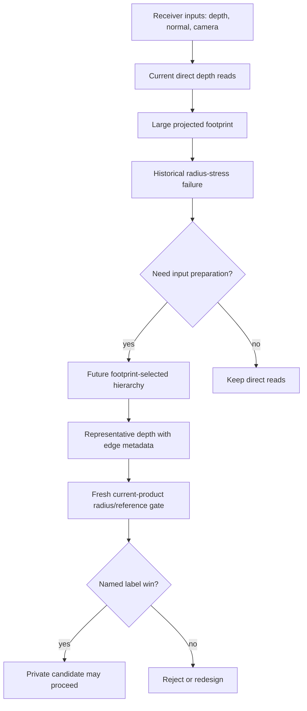

# Phase 4.1 Decision: Depth Preparation

## Decision

Depth hierarchy or representative depth remains a valid receiver input
preparation candidate, but it is not ready for production implementation or
promotion in this SDD slice.

The historical radius-stress gate proves the problem class: `large-radius` rows
showed `scale-mismatch` while the reference selector predicted depth level `1`.
That justifies keeping depth preparation on the roadmap. It does not justify
reviving the rejected 2x2 farthest-supported prefilter, and it does not justify
adding public options.

## What It Replaces

| Candidate | Replaces | Does not replace |
| --- | --- | --- |
| Footprint-selected depth hierarchy | direct full-resolution depth reads for large projected sample footprints | raw bitmask visibility math |
| Representative depth | one foreground/background texel dominating a coarse footprint | receiver confidence/support metadata |
| Edge-aware depth preparation | blind coarse depth substitution at discontinuities | cleanup, polish, or denoise decisions |

## Evidence Read

The prior `vbao-depth-hierarchy-evidence` gate captured
`artifacts/benchmarks/ao-vbao-radius-stress-latest.json`. Its raw large-radius
VBAO rows carried `scale-mismatch` and `vbaoExpectedDepthHierarchyLevel: 1`.
That is enough to keep the investigation alive.

The prior `vbao-depth-prefilter-experiment` then tested a 2x2
farthest-supported depth prefilter. `EVIDENCE.md` rejects it because it kept the
same `noise,mud,edge-bleed,scale-mismatch` labels and introduced visible
staircase or false-curvature artifacts. Faster rows were not accepted because
the visual signal got worse.

Current source has also moved on: the active Museum product path keeps a single
product `VBAONode`, current source contracts forbid the old benchmark-only
depth-prefilter and radius-stress hooks, and Phase 2.5 changed the product
radius/contact shape. So the old captures are prior evidence, not current
promotion proof.

## Shape Into This SDD

The future shape is not "add a prefilter pass because XeGTAO/CACAO have one."
It is receiver input preparation:

- choose depth level from projected footprint;
- choose representative depth from local support, not a one-off 2x2 shortcut;
- include edge metadata before substituting coarse depth near discontinuities;
- inventory target format, lifetime, backend, and timing before promotion;
- compare against refreshed radius-stress and reference rows under the current
  product boundary.

## Task List

- [x] Verify prior radius-stress evidence exists and names the failure.
- [x] Verify the prior 2x2 depth-prefilter candidate was rejected.
- [x] Verify active runtime source does not still carry the rejected hooks.
- [x] Record that depth preparation is justified as a candidate family only.
- [ ] Before implementation, refresh a private radius/reference gate against
  current product defaults and current receiver confidence behavior.
- [ ] Before implementation, define the edge metadata and target inventory that
  Phase 4.2 and 4.4 require.

## Non-Promotion Rule

Do not implement or promote a depth hierarchy in this slice. The next acceptable
runtime work is a fresh private candidate that replaces large-footprint direct
depth reads and proves a named label or timing win without `thin-gap`,
`edge-bleed`, `mud`, `halo`, or `scale-mismatch` regression.
