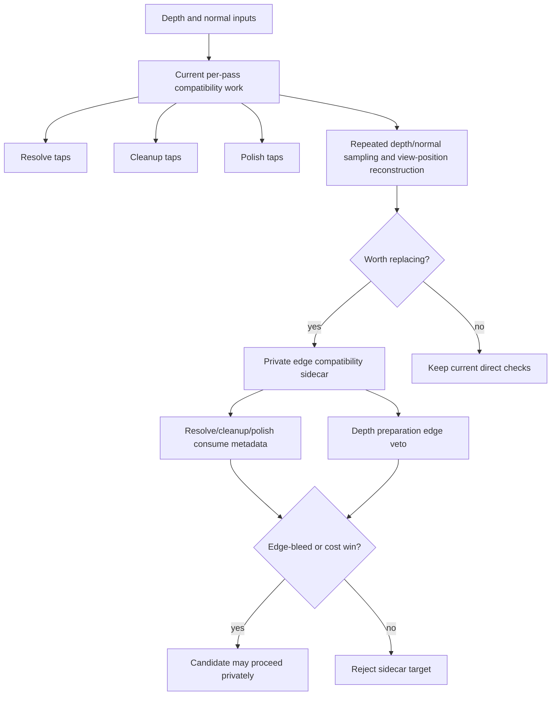

# Phase 4.2 Decision: Edge Metadata

## Decision

Edge metadata can replace repeated reconstruction compatibility work, but it
should not be implemented as a standalone runtime pass in this slice.

The current source already centralizes the bilateral geometry formula in
`computeVbaoBilateralGeometryWeight`. The remaining repeated work is per-stage
and per-tap geometry preparation:

- sample depth;
- sample normal;
- reconstruct center and tap view positions;
- validate depth and normal;
- compute edge-compatible geometry weight.

That work appears in resolve, half-resolution cleanup, and full-resolution
polish. Edge metadata earns a future target only if it replaces that repeated
compatibility work or produces a named `edge-bleed` quality win.

## What It Replaces

| Candidate | Replaces | Does not replace |
| --- | --- | --- |
| Edge compatibility sidecar | repeated depth/normal compatibility checks in resolve, cleanup, and polish | raw receiver visibility estimation |
| Edge veto metadata | recomputing tap rejection from full depth/normal reconstruction in every reconstruction stage | confidence/support semantics |
| Edge-aware depth preparation input | blind coarse depth substitution near discontinuities | public AO controls or denoise knobs |

## Source Read

`VBAOResolveNode`, `VBAOHalfResCleanupNode`, and `VBAOFullResPolishNode` each
sample geometry and reconstruct positions for their own taps. This is real
duplication in cost and data access, not just naming.

The formula itself is not duplicated. `vbaoBilateralWeight.ts` owns the shared
plane-distance and normal-agreement weighting, and source-contract tests already
pin that centralization. So the next improvement is not another helper around
the same expression. It is a measured metadata sidecar or nothing.

## Prior Evidence

Archived edge/confidence metadata work showed useful debug signals:
`edge-normal` and confidence could guide a later filter, while `edge-depth` was
only diagnostic because broad fields could become `false-curvature` if consumed
blindly.

Archived metadata-aware and custom bilateral filters also failed promotion when
they kept or introduced `noise`, `mud`, `edge-bleed`, `thin-gap`, or
`false-curvature`. That means edge metadata is useful as replacement evidence,
not as an automatic filter pass.

## Shape Into This SDD

The receiver-shaped candidate is an internal edge compatibility sidecar, not a
public feature. It should be designed only with Phase 4.4 inventory in hand:
target format, lifetime, backend, consumer stages, dispatch/pass timing, and
which repeated samples or reconstructions it removes.

## Task List

- [x] Verify the source already centralizes bilateral geometry weighting.
- [x] Verify resolve, cleanup, and polish still repeat geometry preparation.
- [x] Verify prior metadata debug evidence warns against blind `edge-depth`.
- [x] Record edge metadata as a justified candidate family only.
- [ ] Before implementation, define the exact target inventory required by
  Phase 4.4.
- [ ] Before implementation, name the expected replacement: fewer geometry
  samples/reconstructions, lower pass cost, or cleaner `edge-bleed` labels.

## Non-Promotion Rule

Do not add an edge metadata pass merely because XeGTAO/CACAO have edge data.
Add it only when the candidate says what repeated compatibility work it removes
and proves a named cost or quality win without `thin-gap`, `mud`, `halo`,
`edge-bleed`, `false-curvature`, or `scale-mismatch` regression.
