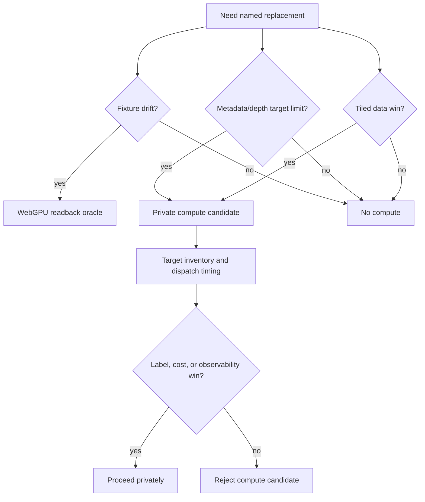

# Phase 4.3 Decision: Compute Boundary

## Decision

Do not add a new product compute path in this slice.

Compute stays valid where it replaces something real:

- the WebGPU fixture readback oracle replaces screenshot-proxy guessing for
  GPU/CPU estimator drift;
- the private `sector-confidence-smoke` candidate proves that a StorageTexture
  can feed the product graph and can report dispatch timing;
- future compute work may replace render-target limitations for metadata,
  depth preparation, tiled data, or readback.

The existing smoke candidate does not win a product quality gate. The latest
compute-smoke summary still carries `noise,edge-bleed`, and its timing is a
CPU-side `renderer.compute()` duration, not pass-level GPU timestamp evidence.

## What It Replaces

| Compute lane | Replaces | Does not replace |
| --- | --- | --- |
| Direct WebGPU fixture readback | rendered screenshot proxy for fixture-level GPU/CPU drift | product AO path |
| `sector-confidence-smoke` StorageTexture | uncertainty about private compute output feeding a TextureNode consumer | confidence semantics or edge metadata |
| Future metadata/depth compute | render-target limits or repeated data-shape work | raw bitmask kernel identity |

## Current Source Boundary

`VBAONode` does not call `renderer.compute`, public options do not expose compute
or storage targets, and package exports do not expose compute nodes. The compute
candidate lives in the demo evidence layer:

- `apps/demo/src/scenes/vbaoComputeCandidate.ts` owns the private
  `StorageTexture` smoke path;
- `MuseumScene.tsx` measures CPU dispatch timing and keeps normal Museum VBAO
  off that path;
- `collect-ao-benchmark.mjs` records compute candidate label, inventory, and
  timing;
- `collect-ao-gpu-readback-baseline.mjs` records WebGPU backend status, storage
  inventory, output resolution, and dispatch/readback timings for the oracle.

## Shape Into This SDD

Compute is a data-shape tool. It is not an algorithm identity and not a rewrite
permission slip.

## Task List

- [x] Verify direct WebGPU readback has a named oracle/readback win.
- [x] Verify `sector-confidence-smoke` proves integration shape only.
- [x] Verify public `VBAONodeOptions` and package exports stay compute-free.
- [x] Record that no new product compute path is added in Phase 4.3.
- [x] Before the next compute candidate, include target format, lifetime,
  backend, and dispatch timing in the evidence rows.

## Non-Promotion Rule

Reject compute candidates that only look architecturally cleaner. A candidate
must identify the render-target, storage, tiled-data, timing, or observability
limit it replaces, then prove that win without worse quality labels.
