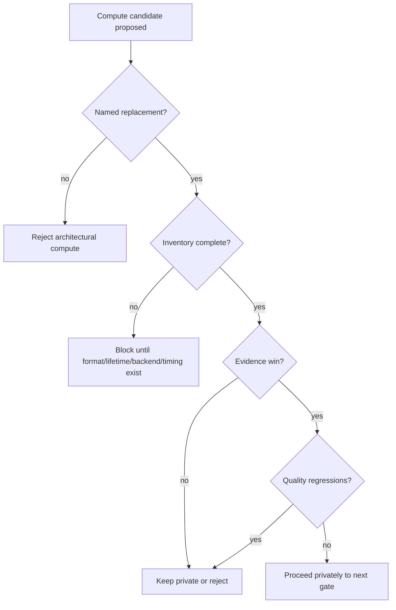

# Phase 4.5 Gate: Reject Architectural Compute

## Decision

Reject compute candidates that are only architecturally neat.

Compute is accepted only when it replaces a named limitation and the evidence
row proves that replacement. A clean pass graph, storage texture, or compute
dispatch is not a product win by itself.

## Current Verdicts

| Candidate | Accepted role | Product promotion | Reason |
| --- | --- | --- | --- |
| WebGPU fixture readback | Oracle/readback evidence | Not a product path | Replaces screenshot-proxy guessing for GPU/CPU fixture drift. |
| `sector-confidence-smoke` | Private integration and timing evidence | Rejected | Proves StorageTexture to TextureNode wiring and CPU dispatch visibility, but rows remain candidate-only and carry `noise` blockers. |
| 2x2 depth prefilter | None | Rejected | Same failure labels as baseline plus false-curvature/staircase risk. |
| Future edge/depth metadata compute | Candidate family only | Blocked | Needs target inventory, consumer stages, reference coverage, and a named edge/cost/observability win. |

## Gate

Named replacement means one of:

- fixture-level oracle/readback accuracy;
- fewer repeated depth/normal compatibility samples;
- a storage or tiled-data shape that a render target cannot express cleanly;
- an observability row that blocks or unblocks a future candidate;
- lower measured pass cost without worse quality labels.

## What Must Not Happen

- Do not claim compute as faster from CPU dispatch timing alone.
- Do not promote a compute smoke row when `noise`, `edge-bleed`, `thin-gap`,
  `mud`, `halo`, `false-curvature`, or `scale-mismatch` remain blocking labels.
- Do not expose compute controls through `VBAONodeOptions`.
- Do not replace render-target code with compute because it looks cleaner.
- Do not use inventory completeness as a quality claim.

## Phase 4 Close

Phase 4 did not add a product depth hierarchy, edge sidecar, or product compute
path. It clarified the valid candidate families, added compute inventory fields
to evidence rows, captured those fields, and rejected promotion without a named
win.
