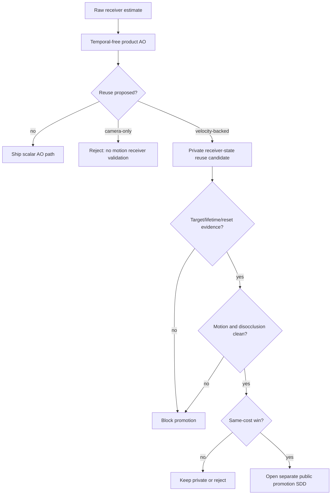

# Phase 5 Decision: Receiver Reuse

## Decision

Treat temporal AO work as receiver-state reuse, not as a public temporal feature.

The useful idea is not "add temporal" as a mode. The useful idea is to reuse a
previous receiver visibility estimate only when the history can be proven valid
for the current receiver under motion, reset, depth, normal, velocity, and
disocclusion checks.

## Current Truth

| Lane | Status | Reason |
| --- | --- | --- |
| Camera-only AO temporal | Rejected | It has no motion vector or previous-guide contract, so it cannot prove receiver history validity under camera/object motion or disocclusion. |
| Host TAA/TRAA | Evidence lane only | It can validate host-owned reprojection patterns, but does not justify AO-owned temporal API by itself. |
| Private velocity-backed AO temporal | Private `reject-promotion` | The node exists and renders, but promotion is blocked until same-cost static, reset/lifetime, motion/disocclusion, diagnostics, and clean-checkout evidence all pass. |
| Public `temporal` option | Blocked | No public option is justified by this SDD. Any public work requires a separate promotion SDD after private candidate success. |
| Confidence-guided validation | Deferred | Confidence may become a validation input only after the base velocity-backed path wins. Adding confidence history before that is tuning without a proven base. |

## Why This Belongs In Receiver Solver

Receiver reuse is the same ownership problem as cleanup, polish, confidence, and
edge metadata: the product starts from a raw receiver estimate and decides how
much reconstruction or reuse can be trusted.

Temporal reuse becomes legitimate only when the reused value is still a valid
estimate for the current receiver. That makes it a validation problem first and
an accumulation problem second.

## What It Replaces

| Candidate | Could replace | Does not replace yet |
| --- | --- | --- |
| Camera-only temporal | Nothing | Motion-aware receiver validation, same-cost spatial rows, or public API review. |
| Velocity-backed temporal | Some per-frame spatial work, if it wins at the same cost under motion | Current scalar product output, `VBAONodeOptions`, README claims, or release evidence. |
| Confidence as temporal validation | Some history acceptance heuristics, after the base velocity path wins | Velocity, previous depth, previous normal, reset/lifetime inventory, or motion evidence. |

## Shape Into This SDD

## Source And Evidence Contracts

- `openspec/adr/ADR-014-camera-only-temporal-rejection.md` rejects camera-only
  AO temporal and keeps only velocity-backed private work in scope.
- `openspec/changes/vbao-velocity-temporal-ao/design.md` keeps temporal
  orchestration out of `VBAONode` and keeps host-owned guides separate from
  AO-owned history.
- `openspec/changes/vbao-velocity-temporal-ao/sdd-plan.md` records the current
  `reject-promotion` result and blocks public API, threshold knobs, and
  static-only promotion.
- `packages/horizon-ao/src/__tests__/vbaoNodeSource.test.ts` proves public
  `VBAONodeOptions` and package exports remain temporal-free, camera-only
  accumulation stays removed, and `VBAOVelocityTemporalNode` remains private,
  velocity-driven, and host-guide-owned.
- `artifacts/benchmarks/vbao-temporal-gate-verdict.md` currently reports
  `reject-promotion`, no internal temporal allowance, and incomplete
  velocity-backed promotion evidence.

## Task List

- [x] Reframe temporal work as receiver-state reuse.
- [x] Keep camera-only temporal rejected.
- [x] Keep velocity-backed temporal private until same-cost motion evidence wins.
- [x] Keep public `VBAONodeOptions` temporal-free in this SDD.
- [x] Defer confidence-as-history-validation until the base velocity path wins.

## Non-Promotion Rule

Do not promote temporal because a temporal pass exists. Promote only if the
receiver reuse gate proves that history is valid, cheaper or better than the
same-cost spatial alternative, clean under motion/disocclusion, and represented
by tracked evidence.
