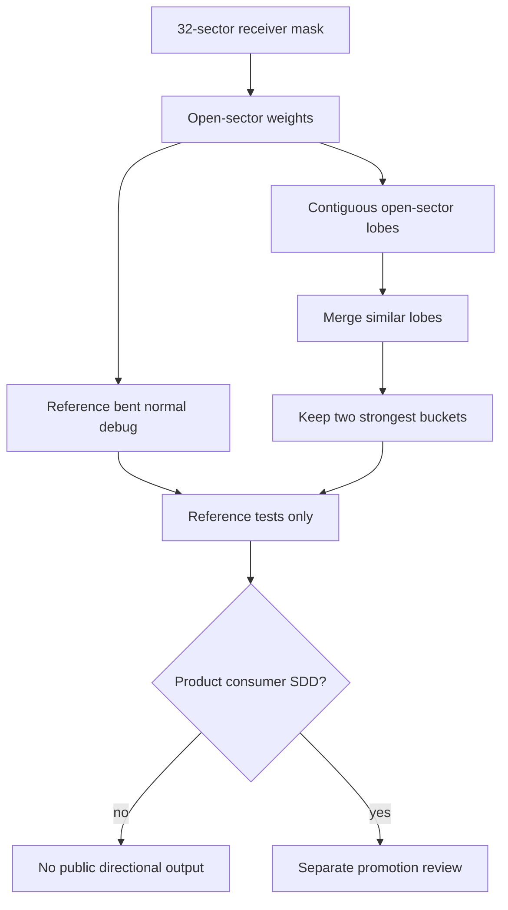

# Phase 6 Decision: Directional Visibility

## Decision

Directional visibility is reference-only in this SDD.

The valid idea is to derive directional information from the existing receiver
visibility mask. It is not a new estimator, not a public bent-normal feature,
and not a reason to distract from scalar AO release blockers.

## Current Truth

The directional reference change existed as documentation, but this checkout did
not contain the referenced `src` implementation or tests. Phase 6 lands the
active implementation under the reference layer instead:

- `packages/horizon-ao/reference/vbaoReference.ts` exports
  `reconstructDirectionalVisibility` for reference tests.
- `packages/horizon-ao/reference/__tests__/vbaoDirectionalVisibility.test.ts`
  proves full-open, full-blocked, symmetric, separated-lobe, and bucket-cap
  behavior.
- `packages/horizon-ao/src/__tests__/vbaoNodeSource.test.ts` proves the
  directional reference does not leak into package exports or
  `VBAONodeOptions`.

## What It Replaces

| Candidate | Replaces | Does not replace |
| --- | --- | --- |
| Bent normal debug compression | A vague "directional AO" claim with no mask-derived proof | Product scalar AO, public API, or lighting integration. |
| Open-sector buckets | The single-vector lie in two-opening cases | Same-cost scalar evidence, release labels, or a consumer SDD. |
| Reference directional reconstruction | Separate estimator speculation | Runtime shader path, render targets, or README claims. |

## Shape Into This SDD

## Reference Contract

Directional reconstruction uses the same receiver state as scalar VBAO:

- bit `0` means an open sector;
- bit `1` means an occluded sector;
- sector directions are reconstructed from the current view frame and slice
  direction;
- sector weights are cosine-compatible with the projected receiver normal;
- contiguous open sectors form lobes;
- similar lobe directions may merge;
- the first reference pass caps output at two buckets.

The cap is intentional. It proves the two-opening case without pretending to be
a general lighting representation.

## Task List

- [x] Keep directional visibility reference-only until scalar gates are stable.
- [x] Derive buckets and bent debug output from open sectors, not from normals
  alone or a second estimator.
- [x] Prove separated open lobes stay separated.
- [x] Keep public bent/directional output blocked without a consumer SDD.

## Non-Promotion Rule

Do not promote directional output because the reference can compute it. Promote
only after a separate consumer SDD proves how the buckets are used, what product
claim they support, what render target/API shape they need, and why scalar AO is
not enough for that consumer.
