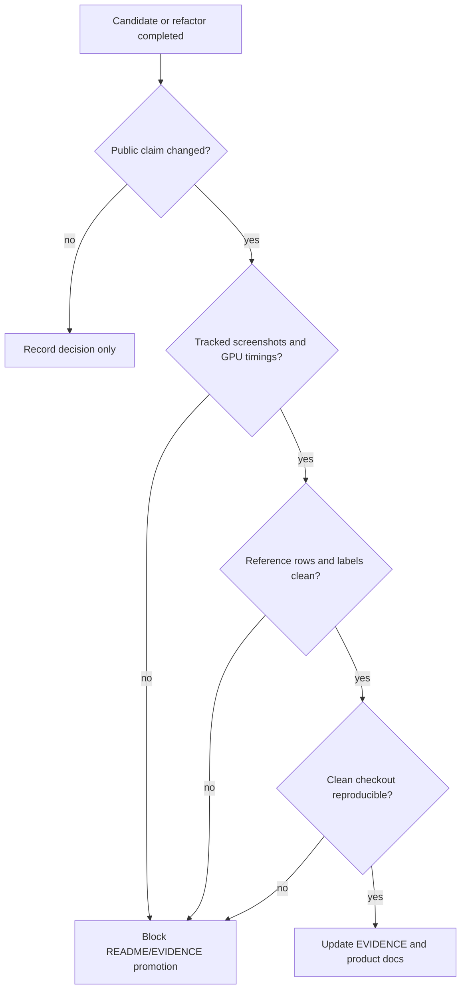

# Phase 7 Decision: Evidence And Claims

## Decision

Do not update product evidence or release claims from this SDD.

The receiver-solver work changed architecture, private candidate gates,
reference contracts, and source boundaries. It did not produce a complete
release evidence package with tracked screenshots, GPU timings, quality labels,
reference rows, and clean-checkout reproducibility for public promotion.

## Current Product Claim

The public product remains scalar AO:

```text
vbao(depthNode, normalNode, camera, options) -> scalar AO texture
```

`README.md` remains release-blocked and scalar-only. Phase 7 corrected the
README algorithm wording so it says final accessibility uses projected-normal
slice weights instead of a plain mean across slices.

## Evidence Boundary

`EVIDENCE.md` is not updated for Phase 5 or Phase 6 because receiver reuse and
directional visibility did not add public render evidence.

Phase 3 confidence and Phase 4 compute inventory produced useful private
candidate artifacts, but they still do not satisfy the release evidence gate:

- confidence rows are private candidate/control evidence, not public metadata;
- compute inventory rows prove format, lifetime, backend, and dispatch timing,
  not product quality;
- temporal verifier output remains `reject-promotion`;
- directional visibility is reference-only and has no product consumer;
- current release readiness still has missing reference observations and
  blocking quality labels.

## Rejected Or Deferred Candidates

| Candidate | Status | Measured or recorded reason |
| --- | --- | --- |
| Confidence-guided reconstruction | Private candidate | Phase 3 evidence did not justify public API or promotion. |
| Depth prefilter / hierarchy | Rejected or candidate-family only | Historical rows justify the question, but the old 2x2 farthest-supported prefilter had quality risks and no current-product win. |
| Edge metadata | Candidate-family only | Needs target inventory, consumer stages, reference coverage, and named edge/cost win. |
| Compute smoke | Private evidence only | StorageTexture integration and dispatch timing are visible, but rows remain candidate-only and quality labels still block promotion. |
| Camera-only temporal | Rejected | ADR-014 rejects it because it cannot validate receiver history under motion or disocclusion. |
| Velocity-backed temporal | Private `reject-promotion` | Needs complete same-cost, reset/lifetime, diagnostics, motion/disocclusion, and clean-checkout evidence before candidate review. |
| Directional buckets / bent debug | Reference-only | Tests prove separated lobes, but no product consumer SDD or public target/API shape exists. |

## Gate Diagram



## Task List

- [x] Do not update `EVIDENCE.md` without screenshots, timings, labels,
  reference rows, and reproducibility.
- [x] Keep README/product claims blocked until release gates are complete.
- [x] Record rejected candidates with measured or source-backed reasons.
- [x] Preserve scalar AO as the only public product output.

## Non-Promotion Rule

No README, EVIDENCE, package, or public API claim may promote confidence,
compute, temporal, directional buckets, or bent normals from this SDD. The
correct next public claim still depends on the release gates, not on architecture
enthusiasm.
