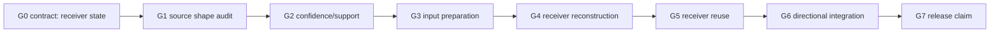

# Ultraplan: VBAO Receiver Visibility Solver

## North Star

HorizonAO is a receiver visibility solver with a screen-space implementation.

The public product remains scalar AO. The internal product direction becomes:

```text
receiver state first
scalar output now
contact product model now
confidence/support next
validated reuse later
directional visibility only from the same state
```

This is not hype and not a prototype escape hatch. It is the architecture that
keeps the visibility bitmask meaningful across quality, reconstruction,
temporal, and optimization work.

## Current Truth

- `VBAONode` is the public product boundary.
- `getTextureNode()` returns product AO.
- `getRawTextureNode()` is debug/readback only.
- Runtime source already uses a 32-sector `u32` mask in the raw kernel.
- Normal input is required.
- The product is temporal-free by default.
- Velocity-backed temporal exists only as private candidate/evidence work.
- Directional visibility exists as reference planning, not public product.
- Release readiness is incomplete.

## The Shape Change

Old mental model:

```text
Screen-space AO pass
  -> clean noisy texture
  -> polish
  -> compare screenshots
```

New mental model:

```text
Receiver solver
  -> estimate visibility state
  -> validate compatibility
  -> reconstruct trusted state
  -> reuse state only when compatible
  -> integrate scalar/directional result
```

This replaces a pass-name architecture with a state-contract architecture.

## Gate Stack



## Readiness

| Area | Readiness | Reason |
| --- | ---: | --- |
| Scalar receiver estimate | 80% | Current kernel has the right bitmask/cosine contracts, but product evidence still has labels. |
| Receiver terminology in docs | 20% | Concept exists in reviews, not yet as canonical SDD vocabulary. |
| Source structure | 55% | Public node and pass boundaries are good; ownership names still read post-effect first. |
| Product API collapse | 70% | `contact` and `advanced` are now the right shape; docs/evidence must keep old low-level aliases framed as compatibility. |
| Confidence/support | 25% | Prior smoke/evidence exists, but no promoted receiver-state metadata contract. |
| Input preparation | 30% | Depth hierarchy and compute lanes are planned/evidence-only. |
| Receiver reuse | 45% | Velocity-backed private path exists, but verdict remains reject-promotion. |
| Directional integration | 25% | Reference direction is planned; product remains scalar. |
| Public product claim | 0% | Release readiness remains incomplete. |

## Phase Map

| Phase | Goal | Stop Condition |
| --- | --- | --- |
| R0 | Canonicalize receiver-solver SDD | Docs/spec delta exist and pass diff hygiene |
| R1 | Audit source shape | Refactor list names ownership improvements and no formula changes |
| R2 | Behavior-preserving refactor | Runtime graph is clearer without output/evidence drift |
| R2.5 | Product API collapse | Contact/advanced shape is pinned and presets stop all-half-res defaulting |
| R3 | Confidence/support candidate | Metadata improves labels or cost vs scalar control |
| R4 | Input prep/compute candidate | Depth/edge/compute wins a named gate |
| R5 | Reuse candidate | Velocity-backed reuse beats same-cost spatial in motion |
| R6 | Directional reference | Buckets/moments prove useful without scalar distraction |
| R7 | Product claim | Reference observations, thresholds, screenshots, timings, and labels are clean |

## Implementation Slices

### R0: Canonical Receiver Contract

Deliver:

- this SDD;
- spec delta;
- diagram;
- tasks.

Gate:

- no runtime code changes;
- no public API expansion;
- no product claim.

### R1: Refactor Audit

Deliver a focused audit before touching source.

Audit questions:

- Which names still imply "AO texture blur" instead of receiver state?
- Which pass classes already fit receiver reconstruction?
- Which tests pin pass names rather than behavior?
- Which private benchmark hooks should move behind clearer evidence boundaries?
- Can `VBAONode.ts` express receiver estimate/product ownership without growing?

Gate:

- every proposed refactor says what it replaces and why;
- no formula changes in audit or behavior-preserving refactor slice.

### R2: Behavior-Preserving Source Refactor

Allowed:

- naming cleanup around receiver estimate/product output;
- pass ownership cleanup through `VBAOEffectPass`;
- source tests updated to receiver terminology;
- docs/comments that remove post-effect framing.

Not allowed:

- shader formula changes;
- new render targets;
- public options;
- confidence, temporal, or compute code.

Gate:

- targeted source tests pass;
- generated shader inspection still identifies the same raw loop shape if
  inspected;
- evidence labels are not reinterpreted.

### R2.5: Product API Collapse

Allowed:

- `contact` as the product finite-occluder prior;
- `advanced` as the home for low-level overrides;
- deprecated top-level aliases for older callers and evidence lanes;
- preset policy that keeps performance half-res but moves balanced/quality/ultra
  away from all-half-res defaults.

Not allowed:

- public confidence output;
- public temporal;
- public denoise controls;
- hiding evidence lanes by removing explicit low-level overrides.

Gate:

- source contracts pin `contact`, `advanced`, and preset resolution policy;
- capability spec names contact as the product concept;
- old low-level fields are compatibility, not the taught product model.

### R3: Receiver Confidence/Support

Deliver:

- RED tests for confidence semantics;
- private `RG16F` or equivalent metadata candidate;
- benchmark rows comparing scalar control and metadata candidate;
- reconstruction policy using confidence to reduce blind polish.

Gate:

- improves one named label or reduces pass cost;
- does not regress thin-gap, edge-bleed, mud, halo, or scale-mismatch;
- remains private if it cannot explain a win.

### R4: Input Preparation And Compute

Deliver only if R3 or reference evidence exposes the need:

- depth hierarchy/representative-depth candidate for large footprint samples;
- edge metadata candidate for reconstruction;
- compute candidate for storage or tiled data shape.

Gate:

- every new target has format/lifetime/timing inventory;
- compute must win a named gate, not merely look cleaner.

### R5: Receiver Reuse

Temporal is not rejected. Camera-only temporal is rejected. Receiver reuse is
valid when it has compatibility evidence.

Deliver:

- velocity-backed private reuse;
- host-owned previous depth/normal guides;
- AO-owned history only;
- diagnostics;
- same-cost static and motion matrices.

Gate:

- temporal wins after its own pass cost;
- motion/disocclusion labels are clean;
- public API stays blocked until this is candidate.

### R6: Directional Integration

Directional work belongs to receiver visibility because it is derived from open
sectors.

Deliver:

- reference open-sector buckets;
- bent normal only as debug compression;
- consumer decision before product output.

Gate:

- separated open lobes do not collapse;
- scalar AO quality gates remain primary.

## What Must Not Promote Yet

- Public `temporal` option.
- Public `confidence` or `metadata` option.
- Public denoise controls.
- Public mask texture.
- Public bent-normal/directional output.
- README release claims.
- "Almost path traced" language.
- Full compute rewrite.

## What Should Replace More Work

The receiver model earns its keep only if it replaces cost or ambiguity:

- confidence replaces blind polish decisions;
- support replaces guessing why a sector is unstable;
- depth preparation replaces noisy full-res far samples;
- edge metadata replaces repeated compatibility checks;
- temporal reuse replaces more raw samples only in motion-safe rows;
- directional buckets replace misleading single-vector bent output.

If a candidate does not replace something real, it stays out.

## Kill Criteria

Stop or narrow a lane if:

- it requires public knobs before internal presets can be tested;
- it hides a formula change inside a refactor;
- it adds targets without timing/lifetime inventory;
- it improves still screenshots but fails motion, thin gaps, or edge labels;
- it makes `VBAONode.ts` a coordinator for every future feature;
- it treats external authority as local evidence.
