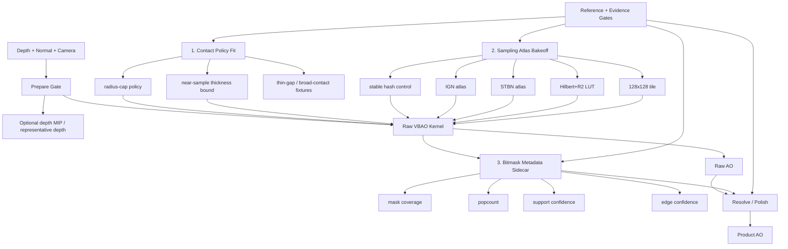

# Integrated SDD Direction: Contact, Sampling, Bitmask Metadata

## Purpose

Put the research, community implementations, repo evidence, and peer-review
feedback into one actionable direction.

The decision is not to copy SSILVB, Shadertoy, XeGTAO, CACAO, IGN, STBN, or
Hilbert/R2 wholesale. The decision is to keep `VBAONode` as the 32-sector
visibility-bitmask product and harden the places where the current product
throws away signal or asks the wrong stage to solve the problem.

## Synthesis

### Source Lessons

| Source | Learning | Local consequence |
| --- | --- | --- |
| SSILVB / CDRIN notes | The `u32` bitmask is the core representation; finite thickness replaces a two-horizon height-field assumption; popcount is the cheap reduction. | Keep 32 sectors for v1 and do not reintroduce GTAO falloff as the first fix. |
| Shadertoy / community ports | Useful for compact math and experimentation, but source/license/port quality varies. The Three issue explicitly calls one port unbalanced/AO-only. | Capture community snippets as evidence cards before borrowing code or formulas. |
| XeGTAO | Production quality comes from reference tuning, depth prefilter/MIPs, edge metadata, spatial denoise, and disciplined sampling, not one magic equation. | Add gates and metadata around VBAO instead of turning the raw shader into a kitchen sink. |
| STBN / blue-noise work | Blue/STBN masks are strongest when matched to the filter/temporal strategy. | Evaluate as atlas candidates with raw/product metrics; do not assume STBN wins spatial-only VBAO. |
| IGN | Very cheap, stable, useful for dithering and TAA-friendly jitter. | Try CPU-baked IGN atlas first; procedural IGN enters the raw shader only after a texture-vs-ALU timing gate. |
| EA coverage bitmasks | Bitmasks are useful because they preserve structured coverage information for later stages. | Do not reduce all mask structure to scalar AO too early; export internal metadata for filters/debug gates. |
| Local evidence | Support-bitmask and prior Hilbert-style candidates produced useful diagnostics but also showed parity/visual traps. | Reuse the lesson, not the rejected candidate blindly. |

## The Three-Lane Plan

### 1. Contact Policy Fit

First target: replace the unlabeled contact heuristics with named internal
policies and fit them against reference fixtures.

Scope:

- `radius * 0.3` base-thickness cap;
- `sampleDist * 0.85` near-sample thickness bound;
- near-contact finite occluders;
- broad wall/contact;
- valid thin gaps that must remain open;
- normal-sensitive and grazing finite-geometry cases.

Acceptance:

- RED ray-cast/reference cases exist before shader edits.
- Broad/contact AO improves only if thin-gap preservation survives.
- The chosen policy is internal and named; no public `VBAONodeOptions` expansion.
- Source tests migrate from exact literal strings to named policy contracts.

Why first:

The thinness complaint maps directly to source-verified behavior. Sampling can
change texture, but it cannot make a collapsed near-contact interval physically
meaningful. This is where we need discipline: fix geometry signal before making
noise prettier.

### 2. Sampling Atlas Bakeoff

Second target: evaluate sampling/noise as data placement, not hot-loop branch
spray.

Candidates:

- current `phase-atlas-stable-hash` control;
- CPU-baked IGN atlas;
- CPU-baked STBN/static blue-noise atlas;
- Hilbert+R2 LUT/precomputed atlas;
- 128x128 tile variants;
- same-cost slice/sample changes.

Acceptance:

- Candidates are private benchmark labels.
- Atlas dimensions, phase count, phase layout, and placement are recorded.
- Raw and product rows both exist.
- Metrics include `patternNoiseScore`, stripe proxy, thin-gap proxy,
  edge-bleed proxy, screenshots, and timing.
- Procedural shader sampling is allowed only if atlas/LUT placement cannot win
  or if texture bandwidth becomes the measured bottleneck.

Why second:

XeGTAO's Hilbert/R2 lesson is real, but local evidence already shows that
copying the word "Hilbert" can create a visible checker/grid field. Sampling
must be evaluated in this renderer, with this resolve/polish path.

### 3. Bitmask Metadata Sidecar

Third target: preserve bitmask-derived information for resolve/polish and debug
views instead of collapsing everything into one scalar too early.

Metadata candidates:

- mask coverage;
- popcount;
- one-hit/stochastic support confidence;
- broad/repeated support confidence;
- edge or transition confidence.

Placement:

- Produced beside raw VBAO, ideally near mask construction or as a private
  sidecar pass.
- Consumed by resolve/polish candidates.
- Exposed only through internal/debug views and benchmark packets.

Acceptance:

- Metadata is GPU-visible and sampleable by the filter candidate.
- Debug views prove nonblank, interpretable output.
- A metadata-aware filter must beat current polish on named labels without
  `mud`, `halo`, `edge-bleed`, or `thin-gap` regression.
- `getTextureNode()` remains final product AO; `getRawTextureNode()` remains
  debug/readback AO.

Why third:

The whole point of a visibility bitmask is that it knows more than scalar AO.
If a sector was touched once by a stochastic sub-sector interval, that should
not carry the same filter confidence as repeated or broad support. This is where
VBAO can become more production-worthy without pretending to be XeGTAO.

## Pipeline Diagram



## Execution Order

1. Add the constant/policy ledger and migrate source tests away from brittle
   literal matching where needed.
2. Add missing contact/reference fixtures.
3. Fit contact policy candidates against those fixtures.
4. Clean up the sampling candidate harness and run atlas/LUT bakeoff.
5. Add GPU-visible bitmask metadata sidecar.
6. Let resolve/polish consume metadata only after debug views and benchmark rows
   prove the metadata is useful.

## Non-Goals

- No 64-sector production promotion from this SDD.
- No public `sectorCount`, `noiseSource`, `thicknessMode`, `denoise`, or
  metadata options.
- No procedural IGN/Hilbert in the hot loop before atlas/LUT candidates fail a
  measured gate.
- No Shadertoy/community code copy without license and source-card capture.
- No README quality claims until `EVIDENCE.md` has screenshots, labels,
  reference rows, and timing.

## Verification Plan

Planning/doc phase:

```sh
git diff --check -- openspec/changes/vbao-signal-quality-studio-gate
pwsh -NoProfile -Command '$bad = Get-ChildItem -File "openspec/changes/vbao-signal-quality-studio-gate" | Select-String -Pattern "\s+$"; if ($bad) { $bad; exit 1 }'
```

First implementation slice:

```sh
pnpm --filter @horizonao/core test -- --run packages/horizon-ao/src/__tests__/vbaoNodeSource.test.ts
pnpm --filter @horizonao/core test -- --run packages/horizon-ao/src/__tests__/vbaoSampling.test.ts
pnpm --filter @horizonao/core test -- --run packages/horizon-ao/reference/__tests__/aoRaycastReference.test.ts
pnpm --filter @horizonao/core typecheck
git diff --check
```
