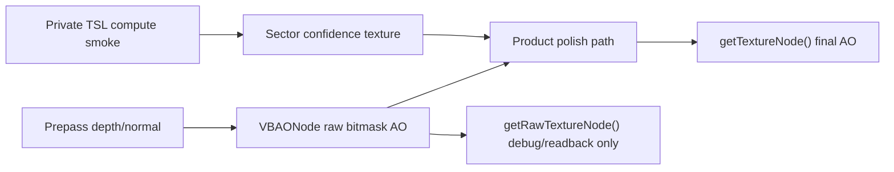

# Product Pipeline Candidate

## Decision

Keep product-pipeline candidates private. Do not promote confidence-aware
polish, edge metadata, or depth hierarchy work from this pass.

The only implemented product-pipeline candidate is the opt-in
`sector-confidence-smoke` smoke. It proves that a TSL compute output can feed
the existing product graph as an internal texture-node input. It does not prove
better AO quality, and normal Museum VBAO does not pay the dispatch cost.

## Candidate Results

| Candidate | Verdict | Reason |
| --- | --- | --- |
| Sector support/confidence metadata | Keep private smoke only | The smoke texture feeds the product graph and reports CPU dispatch timing, but the AO/product row still carries `noise,edge-bleed`. |
| Edge metadata for resolve/polish | Do not prototype yet | Current evidence lacks a clean edge-classification target. Adding another metadata pass before raw/reference gates are cleaner risks hiding defects in polish. |
| Depth hierarchy or representative depth | Do not prototype yet | The active gates still protect thin occluders and valid gaps. A hierarchy candidate must first prove it preserves thin geometry against scalar, ray-cast, and rendered proxy rows. |

## Timing Boundary

`vbao-compute-smoke-summary.md` now reports the private compute candidate in the
same timing table as raw and polish:

- raw: WebGPU timestamp;
- polish: WebGPU timestamp;
- `sector-confidence-smoke`: CPU-side `renderer.compute()` duration.

The CPU timing is intentionally labeled as CPU ms, not GPU ms. This is a smoke
dispatch cost, not a pass-level GPU timestamp.

## API Boundary

`getTextureNode()` remains the final product AO boundary. `getRawTextureNode()`
remains debug/readback evidence only. The compute candidate lives in the demo
evidence layer and is not exported from `@horizonao/core`.

## Promotion Gate

A future metadata or depth candidate can only move forward if it:

- preserves the SSILVB/VBAO 32-sector bitmask identity;
- improves a named quality gate without adding `mud`, `halo`, `edge-bleed`,
  `thin-gap`, or `scale-mismatch`;
- reports compute cost beside raw, cleanup, resolve, and polish;
- keeps public `VBAONodeOptions` unchanged until a separate API SDD proves need.
