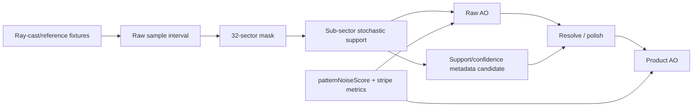

# Raw Signal Attribution

## Purpose

Phase 3 separates raw estimator defects from product polish. The signal-quality
work must know whether a bad pixel came from mask quantization, stochastic
sector support, sampling texture residuals, contact-thickness policy, or final
resolve/polish.

## Attribution Map

| Target | Status | Local proof | Next use |
| --- | --- | --- | --- |
| 32-sector boundary instability | Confirmed diagnostic coverage | `EVIDENCE.md` records support-bitmask attribution, `boundary-risk` anchors, boundary-sector hypotheses, and scalar/GPU parity gaps around boundary-adjacent sectors. | Use as the reason not to promote 64 sectors or support-bitmask metadata without label and parity gates. |
| Stochastic sub-sector variance | Confirmed source/test coverage | `VBAONode.ts` uses `intervalMaskStochasticFn` with `vbaoSubsectorNoise`; source tests require the stochastic interval path and independent phase channels. | Treat one-hit sectors as low-confidence candidates for the metadata sidecar. |
| 64px phase-tile residuals | Confirmed metric coverage | `screenshotMetrics.mjs` exposes `patternNoiseScore`, stripe metrics, and metric basis text; `collect-vbao-noise-source-comparison.mjs` compares `phase-atlas-stable-hash`, IGN, STBN, and fast-like candidates as benchmark-only rows. | Reuse the noise-source comparison for Phase 5 atlas bakeoff before moving procedural noise into the shader hot path. |
| Near-contact sample-distance clamp | Added scalar fixture | `vbaoReference.test.ts` now proves near-contact samples saturate configured thickness when `sampleDist * 0.85` is the active clamp, while the same angular blocker at resolved distance still responds to thickness. | Phase 4 can fit a named contact policy without relying on screenshot impressions. |
| Broad-contact radius cap | Confirmed reference coverage | Phase 2 added `broad-wall-contact`; source/reference paths cap base thickness with `radius * 0.3`. | Keep broad-wall and thin-gap fixtures paired when fitting any replacement for the radius cap. |
| Raw vs product AO separation | Confirmed report coverage | `aoProductionReferenceGate.ts` now reports `vbao-raw` and `vbao-product` separately, so product polish cannot hide raw estimator drift. | Evidence rows must preserve raw/product labels through Phase 5 and Phase 8. |

## Pipeline Placement

## Contact Clamp Correction

The useful finding is narrower than the original noise/thinness diagnosis. A
near sample is not guaranteed to produce fewer sectors than a farther sample;
the back-face projection can cover more angular space depending on the sample
angle. The verified invariant is that close samples can saturate configured
thickness because `effectiveThickness = min(baseThickness, sampleDist * 0.85)`.

That means Phase 4 should evaluate a named contact policy against paired gates:

- thin-gap preservation;
- broad-wall contact;
- grazing and normal-sensitive finite geometry;
- raw VBAO vs product VBAO separation.

No Phase 3 result justifies a public thickness mode, 64-sector production mask,
or temporal denoise shortcut.
