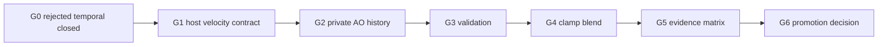

# Ultraplan: Velocity-Backed Temporal AO

## North Star

Ship temporal AO only when it is a measured sample-reuse layer that improves
HorizonAO without weakening the temporal-free product.

The principal-engineer version is harsher: the default answer is "do not build
AO-owned temporal." Each gate has to earn the next gate.

## Diet Principle

```txt
host contract
-> one private temporal node
-> evidence
-> reject or promote
```

Anything else is fat unless a failing gate proves it is needed.

## Gate Stack



## Phase Map

| Phase | Goal | Stop Condition |
| --- | --- | --- |
| 0 | Preserve current rejection truth and ADR | Internal camera-only temporal appears in runtime |
| 1 | Prove host velocity and guide ownership | Host cannot provide previous guide history or velocity direction proof |
| 2 | Add private AO history only | VBAO allocates previous depth/normal targets or output changes while history is invalid |
| 3 | Validate history | Invalid history blends instead of falling back |
| 4 | Clamp and blend | Ghosting or disocclusion labels appear |
| 5 | Benchmark same-cost and motion rows | Missing screenshots, timings, VRAM inventory, motion scene, or spatial alternative |
| 6 | Decide API | Evidence is not `candidate` |

## Implementation Slices

1. Contract slice:
   - no runtime temporal behavior;
   - source-contract tests only;
   - freeze velocity/guide/reset vocabulary.

2. Host adapter slice:
   - demo provides velocity and previous guides;
   - benchmark reports availability;
   - velocity direction fixture exists;
   - no AO history yet.

3. Private node slice:
   - `VBAOVelocityTemporalNode`;
   - one `R16F` AO history target;
   - invalid history returns current AO;
   - valid history produces temporal output.

4. Validation slice:
   - velocity reprojection;
   - previous depth/normal agreement;
   - viewport and reset rejection.

5. Clamp/blend slice:
   - 3x3 AO min/max clamp;
   - `0.8` private base weight;
   - no public knobs.

6. Evidence slice:
   - off, host, host TRAA, private velocity internal, same-cost spatial;
   - AO and beauty screenshots;
   - pass timings and failure labels.
   - static and motion/disocclusion scenes.

7. Decision slice:
   - reject, keep private, or candidate;
   - public API remains blocked unless candidate is proven.

## Verification Ladder

```txt
source-contract tests
-> core typecheck
-> demo typecheck
-> benchmark script check
-> WebGPU smoke
-> evidence matrix
-> temporal verifier
-> hard candidate verifier
```

## What Must Not Promote Yet

- Public `temporal` API.
- AO-owned temporal without velocity.
- Private previous depth/normal guide copies.
- History-weight tuning.
- Resolve/polish fusion.
- Confidence history.
- README product claims.
- Static-only evidence.
- Extra file splitting.

## Kill Criteria

End the project and keep temporal private if:

- host guide history requires private VBAO copies;
- motion/disocclusion scenes show blocking labels;
- same-cost spatial rows win or tie after temporal pass cost;
- the implementation needs scattered conditionals across raw, resolve, polish,
  and benchmarks;
- WebGPU target lifetime becomes ambiguous.
- helper modules appear before one node proves insufficient.
