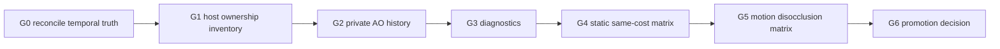

# Ultraplan: Velocity-Backed Temporal AO

## North Star

Ship temporal AO only when it is a measured velocity-backed sample-reuse layer
that improves HorizonAO without weakening the temporal-free product.

The current repo already has a private implementation. The right posture is no
longer "fight temporal"; it is "make temporal earn promotion." The default
public answer stays no until evidence reaches candidate.

## Current Truth

- `VBAOVelocityTemporalNode` exists in `packages/horizon-ao/src`.
- It is private and not exported from `packages/horizon-ao/src/index.ts`.
- It consumes current AO, current depth/normal, velocity, previous depth, and
  previous normal.
- It owns only AO history. Host code owns previous depth/normal guide history.
- It uses the Three TRAA velocity convention:

```txt
offsetUv = velocity.xy * vec2(0.5, -0.5)
historyUv = uv - offsetUv
```

- WebGPU smoke evidence exists and the temporal pass emits timing.
- Target inventory, reset evidence, same-cost static evidence, and
  camera-motion/object-motion/disocclusion evidence are captured.
- `verify:vbao-temporal` returns `reject-promotion`, not `candidate`; the
  velocity lane remains incomplete until diagnostics pass timing is recaptured.
- Temporal diagnostics are emitted in the benchmark row and verifier/report
  paths treat missing diagnostics as incomplete evidence.
- Public API review remains blocked.

## Diet Principle

```txt
host contract
-> one private temporal node
-> diagnostics
-> evidence
-> reject or promote
```

Anything else is fat unless a failing gate proves it is needed.

Canonical temporal shape lives in `design.md` under "Canonical Horizon AO
Temporal Shape". Do not duplicate that ownership table here; this file owns
roadmap, gate order, and readiness.

## SOAP Alignment

This ultraplan is the canonical coordination document for temporal work. Do not
add new planning files unless they contain a distinct artifact type:

- `proposal.md`: why this change exists.
- `design.md`: implementation decisions.
- `sdd-plan.md`: phase execution plan.
- `ultraplan.md`: end-to-end roadmap and gates.
- `tasks.md`: executable checklist.
- `apply-progress.md`: completed work and verification.
- `metaprompt.md`: agent execution prompt.
- `whiteboard.md`: scratch exploration only.

If a new doc only restates gaps, roadmap, or readiness, fold it into this file.
CONCEPTS > more files.

## Readiness

| Area | Current readiness | Notes |
| --- | ---: | --- |
| Private temporal node | 80% | Renders, owns AO history, emits diagnostics, measures temporal pass. |
| Host guide ownership | 85% | Previous guides are host-owned and target/lifetime inventory is reported. |
| Reset behavior | 80% | First-frame, resize, and explicit benchmark reset evidence are captured. |
| Validation logic | 80% | UV, depth, normal, velocity, clamp, and diagnostic reason encoding exist. |
| Static evidence | 100% | Same-cost static matrix is captured. |
| Motion/disocclusion evidence | 100% | Camera-motion, object-motion, and disocclusion rows are captured. |
| Public API readiness | 0% | Correctly blocked. |

Overall temporal readiness: **evidence-complete for this private review,
promotion-blocked by quality gates**, **0% public feature readiness**.

## Gate Stack



## Phase Map

| Phase | Goal | Stop Condition |
| --- | --- | --- |
| R0 | Reconcile current truth | Docs/tests claim all runtime temporal is absent |
| R1 | Inventory host ownership and targets | Complete for this slice |
| R2 | Add diagnostics before tuning | Complete for this slice |
| R3 | Benchmark static same-cost matrix | Complete for this slice |
| R4 | Benchmark motion/disocclusion matrix | Complete for this slice; blocking labels keep verdict rejected |
| R5 | Decide API | Public API remains blocked because evidence is not `candidate` |

## Implementation Slices

### R0: Reconcile The Story

Some docs still speak as if all runtime temporal is absent or rejected. That was
true for camera-only temporal, not for current velocity-backed private temporal.

Deliverables:

- Update source-contract language:
  - camera-only temporal is rejected;
  - velocity-backed internal temporal is private candidate code;
  - public temporal remains absent.
- Keep `VBAOVelocityTemporalNode` out of public exports.

### R1: Inventory Targets And Lifetimes

Temporal cannot promote while target ownership is implicit.

Deliverables:

- AO history target format: `R16F`/`RedFormat`/`HalfFloatType`.
- Current AO source resolution and lifetime.
- Previous guide source and lifetime.
- Resize/DPR/device reset path.
- Host reset signal requirements.

Gate:

- Evidence summary includes target and lifetime inventory.

### R2: Diagnostics Before Tuning

Without diagnostics, threshold changes become vibes. CONCEPTS > sliders.

Deliverables:

- Rejection reason counters or proxy diagnostics:
  - invalid UV;
  - reset;
  - depth reject;
  - normal reject;
  - velocity reject;
  - clamp range.
- Benchmark rows expose diagnostics.
- Verifier fails or marks temporal evidence incomplete when diagnostics are
  absent.

Gate:

- Every temporal evidence row has diagnostics or is incomplete.

### R3: Static Same-Cost Matrix

A temporal row only matters if it beats fair non-temporal alternatives.

Required captures:

- `off`;
- `host`;
- `host` + TRAA;
- `velocity-internal`;
- same-cost spatial alternative.

Gate:

- every row has diagnostics when `velocity-internal`;
- Material pattern/noise win.
- No stripe regression.
- No edge-bleed regression.
- No thin-gap regression.
- Pass timing includes temporal cost.

### R3.5: Target Inventory And Reset Evidence

Do this before interpreting matrix results. Otherwise a win can still be caused
by undefined lifetime behavior.

Deliverables:

- target/lifetime inventory for AO history, current AO, velocity, previous
  depth, and previous normal;
- reset trigger list for first frame, resize/DPR, explicit reset, camera cut,
  and device/format changes;
- smoke evidence that reset diagnostics appear after resize or camera cut.

Gate:

- verifier/report language can say why guide/history lifetime is complete or
  incomplete.

### R4: Motion And Disocclusion Matrix

Temporal can look good in stills and fail in motion. That is the classic trap.

Required captures:

- camera motion;
- object motion;
- disocclusion;
- resize/reset smoke.

Gate:

- No ghosting label.
- No disocclusion label.
- History reset visible after camera cut/resize.
- Motion rows complete with screenshots, timings, and diagnostics.

### R5: Candidate Or Rejection

Private candidates should not live forever without a decision.

Outcomes:

- reject and remove/park if no same-cost win;
- keep private if useful for evidence but not product;
- open public promotion SDD only after candidate verdict.

## Gaps To Address

### Must Address

- Host reset/camera-cut signal.
- Device/DPR/resize reset evidence.
- Temporal diagnostics.
- Full same-cost matrix.
- Motion/disocclusion scenes.
- VRAM/target inventory.
- Verifier hard mode with explicit tracked inputs.

### Should Address

- Separate host guide cost from VBAO temporal pass cost.
- Decide whether AO history stays `R16F` or needs confidence metadata later.
- Measure whether temporal allows fewer raw samples without losing thin/edge
  quality.
- Improve report language so `host`, `host TRAA`, and `velocity-internal` are
  never conflated.

### Do Not Address Yet

- Public `temporal` option.
- Threshold knobs.
- Adaptive blend weight.
- Confidence history.
- Object/material ID.
- Public temporal integration type.

## Verification Ladder

```txt
source-contract tests
-> core typecheck
-> demo typecheck
-> benchmark script check
-> WebGPU smoke
-> evidence matrix
-> temporal verifier
-> hard candidate verifier
```

## What Must Not Promote Yet

- Public `temporal` API.
- AO-owned temporal without velocity.
- Private previous depth/normal guide copies.
- History-weight tuning.
- Resolve/polish fusion.
- Confidence history.
- README product claims.
- Static-only evidence.
- Extra file splitting.

## Current Gate Result

The target/reset evidence, static same-cost matrix, and
camera-motion/object-motion/disocclusion rows are captured. The verifier result
is `reject-promotion`, not private candidate; the velocity lane remains
incomplete until diagnostics pass timing is recaptured.

Next work is not more temporal API or threshold tuning. The only canonical next
gate is quality root-cause work on the blocking labels already reported by the
matrix. Temporal remains private until a later SDD can show a material same-cost
win without ghosting, disocclusion, mud, halo, edge-bleed, or thin-gap failure.

## Kill Criteria

End the project and keep temporal private if:

- host guide history requires private VBAO copies;
- motion/disocclusion scenes show blocking labels;
- same-cost spatial rows win or tie after temporal pass cost;
- the implementation needs scattered conditionals across raw, resolve, polish,
  and benchmarks;
- WebGPU target lifetime becomes ambiguous.
- helper modules appear before one node proves insufficient.
