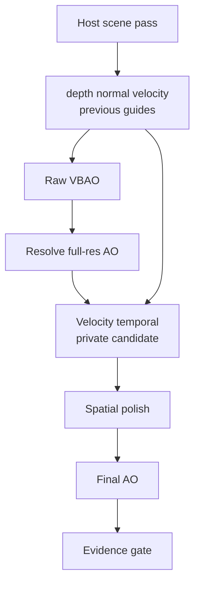

# Whiteboard: Velocity Temporal For HorizonAO

## Candid Rating

Current plan: **7.5/10**.

Why not higher: the host guide contract is still unproven. Until the WebGPU demo
can provide velocity plus previous depth/normal guide history cleanly, internal
temporal is a risk, not a feature.

Why it is worth exploring: the plan keeps `VBAONode` temporal-free, avoids the
rejected camera-only path, and treats temporal as sample reuse rather than blur.

## What It Does

Velocity temporal AO reuses resolved AO from the previous frame only when the
current pixel can prove it is still looking at the same surface.

```txt
current AO + velocity + previous AO + previous depth/normal guides
-> validate history
-> clamp stale history to the current AO neighborhood
-> blend only valid history
-> output smoother AO at lower raw sample cost
```

It does not fix wrong raw AO, wrong scale, bad normals, bad resolve, edge bleed,
or missing motion data. If those are broken, temporal hides the problem in still
screenshots and exposes it in motion. That is why static Museum evidence is not
enough.

## Things To Consider

- Velocity convention: current-to-previous UV must be proven with a fixture.
- Guide ownership: host owns previous depth/normal; VBAO must not copy them.
- Motion: camera motion, object motion, and disocclusion are promotion gates.
- WGPU topology: never sample the active render target; use a separate AO
  history target.
- Cost: temporal pass, host guide cost, AO history, polish, and total product
  time all count.
- Failure labels: ghosting, disocclusion, stripe, edge bleed, thin-gap loss,
  mud, halo, and scale mismatch block promotion.
- API: no public `temporal` option until candidate evidence exists.
- Code health: no temporal branches scattered through `VBAONode`.

## Complete Shape

Complete means six measured parts:

1. Host temporal sampling: phase animation only when integration exists.
2. Host contract: velocity and previous guide history are real.
3. AO history: VBAO owns only resolved AO history.
4. Validation: velocity, viewport, depth, normal, and reset reject bad history.
5. Motion proof: camera motion, object motion, and disocclusion rows exist.
6. Evidence: same-cost spatial comparison decides promotion.

No stubs. No placeholder public options. No helper modules for imagined reuse.

## Diagram



## Diet Rule

The runtime shape should be:

```txt
VBAONode
  owns current-frame raw/reconstruction

VBAOVelocityTemporalNode
  owns AO history and validation

demo host adapter
  owns velocity and previous guide history

verifier
  owns promotion truth
```

If the implementation needs scattered conditionals, private guide copies, public
knobs, or extra helper files before one node proves insufficient, it is getting
fat. Cut it.
